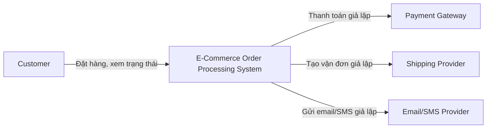
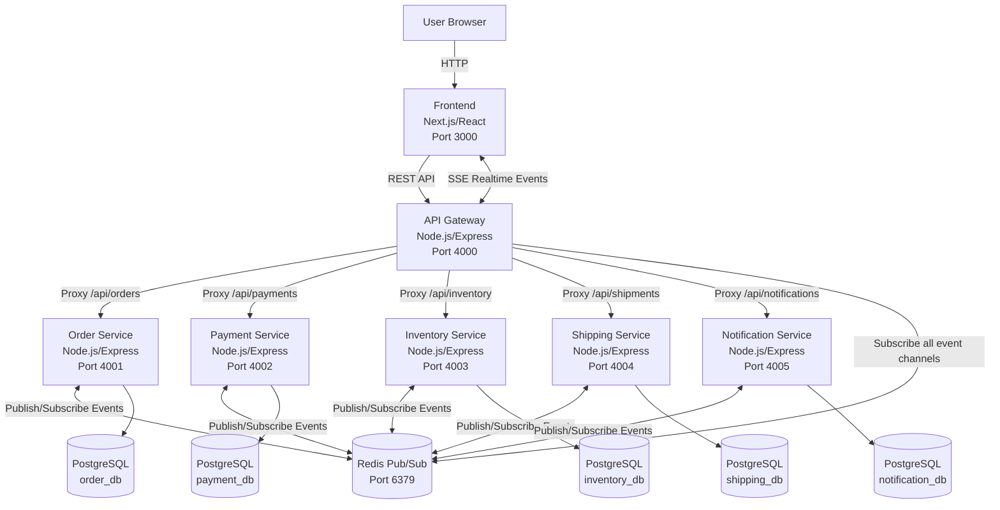
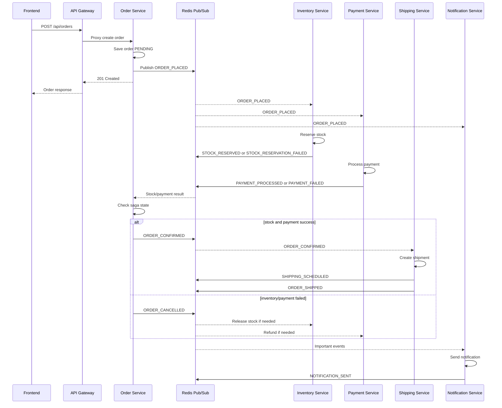
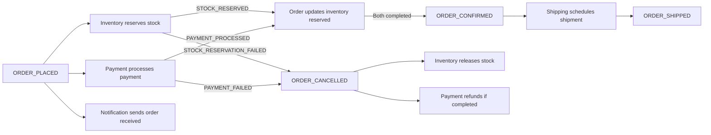
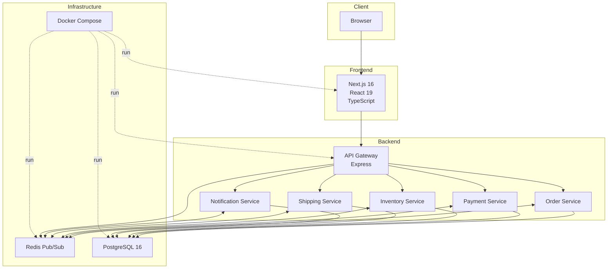

# Lý thuyết kiến trúc và kỹ thuật áp dụng trong project

## 1. Tổng quan project

Project hiện tại là hệ thống xử lý đơn hàng thương mại điện tử theo hướng **Event-Driven Microservices**. Hệ thống mô phỏng quy trình đặt hàng gồm tạo đơn, giữ hàng tồn kho, xử lý thanh toán, lập vận chuyển và gửi thông báo theo thời gian gần thực.

Các thành phần chính:

| Thành phần | Vai trò | Công nghệ |
| --- | --- | --- |
| Frontend | Giao diện tạo đơn, xem dashboard, xem event realtime | Next.js, React, TypeScript |
| API Gateway | Điểm vào duy nhất cho frontend, proxy request đến service, stream event qua SSE | Node.js, Express, http-proxy-middleware |
| Order Service | Quản lý vòng đời đơn hàng, điều phối saga | Node.js, Express, Prisma, PostgreSQL |
| Inventory Service | Quản lý sản phẩm, giữ và hoàn tồn kho | Node.js, Express, Prisma, PostgreSQL |
| Payment Service | Mô phỏng thanh toán, hoàn tiền, idempotency, circuit breaker | Node.js, Express, Prisma, PostgreSQL |
| Shipping Service | Tạo vận đơn, cập nhật trạng thái giao hàng | Node.js, Express, Prisma, PostgreSQL |
| Notification Service | Gửi và lưu log thông báo | Node.js, Express, Prisma, PostgreSQL |
| Redis | Event Bus cho publish/subscribe giữa các service + rate limit store + idempotency store | Redis Pub/Sub + Redis-backed limiter/idempotency |
| PostgreSQL | Lưu dữ liệu nghiệp vụ và event log cục bộ từng service | PostgreSQL |
| Docker Compose | Chạy hạ tầng và các service | Docker |

Lưu ý quan trọng: một số tài liệu/sơ đồ cũ trong project còn ghi Java Spring Boot, Kafka/RabbitMQ, EventStoreDB hoặc Kong. Tuy nhiên code hiện tại đang chạy bằng **Node.js/TypeScript, Express, Redis Pub/Sub, PostgreSQL và Prisma**.

## 2. Architecture Style

Project đang kết hợp nhiều style kiến trúc:

### 2.1. Microservices Architecture

Hệ thống được chia thành các service độc lập theo domain:

- Order Service quản lý đơn hàng.
- Inventory Service quản lý tồn kho.
- Payment Service xử lý thanh toán.
- Shipping Service xử lý vận chuyển.
- Notification Service xử lý thông báo.

Mỗi service có codebase, port, database schema và responsibility riêng. Đây là cách tách theo **business capability**, giúp mỗi domain có thể phát triển, triển khai và scale độc lập.

### 2.2. Event-Driven Architecture

Các service không gọi trực tiếp lẫn nhau trong luồng xử lý chính của đơn hàng. Thay vào đó, chúng publish và subscribe event qua Redis:

- `ORDER_PLACED`
- `STOCK_RESERVED`
- `PAYMENT_PROCESSED`
- `ORDER_CONFIRMED`
- `ORDER_CANCELLED`
- `SHIPPING_SCHEDULED`
- `ORDER_SHIPPED`
- `NOTIFICATION_SENT`

Event-driven phù hợp vì xử lý đơn hàng gồm nhiều bước độc lập, có thể chạy song song và có khả năng thất bại riêng.

### 2.3. API Gateway Pattern

Frontend chỉ gọi API Gateway tại port `4000`. Gateway proxy request đến các service nội bộ:

- `/api/orders` -> Order Service
- `/api/payments` -> Payment Service
- `/api/inventory` -> Inventory Service
- `/api/shipments` -> Shipping Service
- `/api/notifications` -> Notification Service

Gateway cũng cung cấp:

- `GET /api/health` để tổng hợp health check.
- `GET /api/events/stream` để stream event realtime bằng Server-Sent Events.

### 2.4. Database per Service

Mỗi service có database/schema riêng:

- `order_db`
- `payment_db`
- `inventory_db`
- `shipping_db`
- `notification_db`

Điều này đúng với microservices vì service không phụ thuộc trực tiếp vào bảng của service khác. Mỗi service sở hữu dữ liệu của mình.

### 2.5. Saga Pattern - Choreography

Luồng đặt hàng được điều phối bằng event, không có một orchestrator trung tâm. Ví dụ:

1. Order Service tạo đơn và phát `ORDER_PLACED`.
2. Inventory Service nghe event để giữ hàng.
3. Payment Service nghe event để xử lý thanh toán.
4. Khi tồn kho và thanh toán đều thành công, Order Service xác nhận đơn.
5. Shipping Service nghe `ORDER_CONFIRMED` để tạo vận đơn.
6. Notification Service nghe nhiều event để gửi thông báo.

Đây là **choreography-based saga** vì mỗi service tự phản ứng với event liên quan.

## 3. Architecture Characteristics

| Characteristic | Mức độ trong project | Nhận xét |
| --- | --- | --- |
| Scalability | Khá tốt về mặt thiết kế | Mỗi service có thể scale riêng. Tuy nhiên Redis Pub/Sub hiện tại chưa bền vững như Kafka/RabbitMQ. |
| Loose Coupling | Tốt | Service giao tiếp qua event, ít phụ thuộc trực tiếp vào nhau. |
| Deployability | Tốt | Mỗi service có Dockerfile riêng, có thể build/deploy độc lập. |
| Modifiability | Tốt | Thêm service mới như Loyalty/Fraud Detection chỉ cần subscribe event phù hợp. |
| Availability | Trung bình | Nếu một service lỗi, các service khác vẫn có thể chạy, nhưng Redis là điểm phụ thuộc trung tâm. |
| Reliability | Trung bình | Có event store cục bộ, idempotency và circuit breaker, nhưng chưa có durable queue, retry thật và dead letter queue. |
| Performance | Tốt cho demo | Inventory và Payment xử lý song song sau `ORDER_PLACED`. Realtime dashboard dùng SSE. |
| Consistency | Eventual Consistency | Trạng thái đơn hàng được cập nhật dần qua event, không đảm bảo nhất quán tức thời. |
| Observability | Cơ bản | Có log console, health check và SSE event stream. Chưa có metrics, tracing, centralized logging. |
| Security | Cơ bản | Có CORS, chưa có authentication/authorization, rate limit, input hardening. |

## 4. Chương trình dùng kiến trúc gì?

Chương trình dùng kiến trúc chính là:

**Event-Driven Microservices Architecture with API Gateway, Database per Service and Choreography Saga.**

Có thể mô tả ngắn gọn:

> Hệ thống thương mại điện tử được chia thành nhiều microservice độc lập. Frontend giao tiếp qua API Gateway. Các service xử lý nghiệp vụ bằng cách phát và nghe domain event thông qua Redis Pub/Sub. Mỗi service sở hữu database riêng và lưu event log cục bộ để audit.

## 5. Tại sao sử dụng kiến trúc đó?

Kiến trúc này hợp lý với bài toán xử lý đơn hàng vì:

- Quy trình đặt hàng có nhiều bước tự nhiên tách biệt: đặt hàng, kiểm kho, thanh toán, giao hàng, thông báo.
- Một bước lỗi không nên làm sập toàn bộ hệ thống.
- Một số bước có thể chạy song song, ví dụ kiểm kho và thanh toán cùng bắt đầu sau khi tạo đơn.
- Cần mở rộng linh hoạt theo tải: Payment có thể scale riêng nếu nhiều giao dịch, Notification có thể scale riêng nếu nhiều thông báo.
- Cần khả năng theo dõi trạng thái đơn hàng theo event.
- Dễ thêm chức năng mới bằng cách subscribe event mà không sửa nhiều service cũ.

Ví dụ, nếu muốn thêm Fraud Detection Service, service mới có thể nghe `ORDER_PLACED` hoặc `PAYMENT_PROCESSED`, sau đó phát event cảnh báo mà không cần sửa trực tiếp Order Service quá nhiều.

## 6. Kiến trúc này có hợp lý không?

Với mục tiêu học tập và demo kiến trúc phần mềm, kiến trúc này **hợp lý** vì thể hiện được các khối kiến thức quan trọng:

- Microservices
- Event-driven communication
- Saga
- Compensating transaction
- API Gateway
- Database per service
- Event log
- Realtime monitoring
- Docker-based deployment

Tuy nhiên, nếu áp dụng production thật, cần cải thiện:

- Thay Redis Pub/Sub bằng Kafka, RabbitMQ, NATS JetStream hoặc Redis Streams để có durability.
- Thêm retry policy và dead letter queue.
- Lưu saga state vào database thay vì memory.
- Bổ sung distributed tracing bằng OpenTelemetry.
- Bổ sung authentication, authorization và mở rộng rate limiting theo route/user/service.
- Bổ sung test tự động và CI/CD.
- Chuẩn hóa event schema/versioning.

Kết luận: **hợp lý cho demo, học thuật và prototype; cần nâng cấp hạ tầng message broker, reliability và observability nếu đưa lên production.**

## 7. Architecture Characteristic chi tiết

### 7.1. Scalability

Microservices giúp scale theo từng domain. Ví dụ:

- Payment Service có thể scale nhiều instance khi có nhiều giao dịch.
- Notification Service có thể scale riêng khi lượng email/SMS tăng.
- API Gateway có thể scale ngang để nhận nhiều request từ frontend.

Điểm cần lưu ý: Redis Pub/Sub không lưu message cho consumer offline. Nếu service bị down đúng lúc event được publish, event có thể bị mất. Vì vậy scalability hiện tại tốt ở mức demo, nhưng reliability khi scale production còn hạn chế.

### 7.2. Availability

Nếu Notification Service lỗi, Order/Payment/Inventory vẫn có thể xử lý chính. Đây là ưu điểm của event-driven. Tuy nhiên nếu Redis lỗi, toàn bộ luồng async bị ảnh hưởng. Do đó production cần Redis cluster hoặc broker chuyên dụng.

### 7.3. Resilience

Project có một số kỹ thuật resilience:

- Payment Service dùng Circuit Breaker để tránh gọi payment gateway khi gateway lỗi liên tục.
- Inventory và Payment có compensating transaction khi đơn bị hủy.
- Payment có idempotency để giảm rủi ro charge trùng.

Nhưng còn thiếu:

- Retry có kiểm soát cho event handler.
- Dead Letter Queue.
- Persisted saga state.
- Timeout và fallback rõ ràng cho từng bước.

### 7.4. Consistency

Hệ thống dùng **eventual consistency**. Sau khi user tạo đơn, đơn chưa lập tức hoàn tất. Trạng thái sẽ đi qua:

`PENDING` -> `INVENTORY_RESERVED` / `PAYMENT_COMPLETED` -> `CONFIRMED` -> `SHIPPING_SCHEDULED` -> `SHIPPED`

Nếu lỗi:

`PENDING` -> `CANCELLED`

Điều này phù hợp với xử lý đơn hàng vì nhiều bước phụ thuộc hệ thống bên ngoài và không thể gói trong một database transaction duy nhất.

## 8. DevOps

### 8.1. Những gì project đã có

Project đã có nền tảng DevOps cơ bản:

- Dockerfile cho từng service.
- `docker-compose.yml` để chạy Redis, PostgreSQL, API Gateway, microservices.
- Environment variables cho port, database URL, Redis URL, CORS.
- Health check cho Redis, PostgreSQL và API Gateway.
- Build script TypeScript trong từng package.
- Prisma schema riêng theo service.

### 8.2. Quy trình build/run hiện tại

Backend có thể chạy bằng Docker Compose:

```bash
cd backend
docker-compose up --build
```

Frontend chạy riêng:

```bash
cd frontend
npm install
npm run dev
```

Các service backend có thể build riêng:

```bash
cd backend/order-service
npm run build
```

### 8.3. DevOps còn thiếu

Để hoàn chỉnh hơn, nên bổ sung:

- CI/CD pipeline bằng GitHub Actions/GitLab CI.
- Tự động chạy lint, type-check, build và test khi push code.
- Docker image versioning.
- Migration tự động cho Prisma.
- Environment theo dev/staging/production.
- Centralized logging.
- Metrics bằng Prometheus/Grafana.
- Distributed tracing bằng OpenTelemetry.
- Secret management thay vì hardcode password trong compose.
- Kubernetes manifest hoặc Helm chart nếu cần orchestration production.

## 9. Mức độ áp dụng AI

Trong project hiện tại, AI **không phải thành phần runtime** của hệ thống. Hệ thống không dùng AI để quyết định đơn hàng, phân tích fraud, gợi ý sản phẩm hoặc chatbot.

Mức độ áp dụng AI phù hợp để trình bày:

| Mức độ | Áp dụng trong project |
| --- | --- |
| AI hỗ trợ phát triển | Có thể dùng để hỗ trợ viết tài liệu, giải thích kiến trúc, sinh sơ đồ, review code, gợi ý test case. |
| AI trong quy trình DevOps | Chưa có, nhưng có thể dùng AI để phân tích log, phát hiện bất thường, gợi ý tối ưu hiệu năng. |
| AI trong nghiệp vụ | Chưa có. Có thể mở rộng bằng Recommendation Service, Fraud Detection Service hoặc Customer Support Bot. |
| AI tự động ra quyết định | Chưa áp dụng. |

Nếu cần nâng cấp project theo hướng có AI, các hướng hợp lý là:

- Fraud Detection Service nghe `ORDER_PLACED` và `PAYMENT_PROCESSED`.
- Recommendation Service gợi ý sản phẩm trên frontend.
- AI chatbot hỗ trợ tra cứu trạng thái đơn hàng.
- AI log analyzer để phát hiện bất thường trong event stream.

## 10. Các kỹ thuật và Design Pattern

Phần này giải thích từng kỹ thuật theo 4 ý: **là gì**, **hoạt động như thế nào**, **project đang áp dụng ở đâu**, và **áp dụng như vậy có hợp lý không**.

| Kỹ thuật/Pattern | Có trong project | Mức độ áp dụng |
| --- | --- | --- |
| API Gateway | Có | Rõ ràng, đang dùng làm entry point và SSE stream |
| Publish/Subscribe | Có | Rõ ràng, dùng Redis Pub/Sub |
| Saga Pattern | Có | Rõ ràng, choreography saga |
| Compensating Transaction | Có | Rõ ràng cho cancel/refund/release stock |
| Repository Pattern | Có | Rõ ràng trong từng service |
| Circuit Breaker | Có | Có trong Payment Service |
| Idempotency | Có | Có trong Payment Service, nhưng còn in-memory |
| Event Store/Event Log | Có | Có event log cục bộ, chưa phải event sourcing đầy đủ |
| DTO/Shared Contract | Có | Có package shared |
| Retry with Backoff | Có utility | Có code tiện ích, chưa gắn đầy đủ vào event handler |
| Dead Letter Queue | Có TODO | Chưa triển khai thật |
| Server-Sent Events | Có | Dùng stream event realtime lên frontend |
| Database per Service | Có | Mỗi service sở hữu database/schema riêng |

### 10.1. API Gateway Pattern

#### API Gateway là gì?

API Gateway là pattern đặt một lớp cổng vào ở trước các backend service. Client chỉ giao tiếp với Gateway, còn Gateway chịu trách nhiệm chuyển request đến đúng service phía sau.

Trong microservices, nếu không có API Gateway, frontend phải biết nhiều service URL khác nhau như:

- Order Service ở port `4001`.
- Payment Service ở port `4002`.
- Inventory Service ở port `4003`.
- Shipping Service ở port `4004`.
- Notification Service ở port `4005`.

Cách này làm frontend phụ thuộc mạnh vào backend topology. API Gateway giải quyết vấn đề đó bằng cách cung cấp một địa chỉ chung.

#### API Gateway hoạt động như thế nào?

Luồng hoạt động:

1. Frontend gửi request đến API Gateway.
2. Gateway đọc path của request.
3. Gateway proxy request đến service phù hợp.
4. Service xử lý và trả response.
5. Gateway trả response về frontend.

Ví dụ:

```text
Frontend -> GET /api/orders -> API Gateway -> Order Service
Frontend -> GET /api/inventory -> API Gateway -> Inventory Service
Frontend -> GET /api/payments -> API Gateway -> Payment Service
```

#### Project áp dụng ở đâu?

Trong project, API Gateway nằm ở:

```text
backend/api-gateway/src/index.ts
```

Gateway route:

- `/api/orders` đến Order Service.
- `/api/payments` đến Payment Service.
- `/api/inventory` đến Inventory Service.
- `/api/shipments` đến Shipping Service.
- `/api/notifications` đến Notification Service.

Ngoài routing, Gateway còn làm thêm hai việc:

- Tổng hợp health check qua `GET /api/health`.
- Subscribe Redis event rồi stream về frontend qua `GET /api/events/stream`.

#### Vì sao dùng API Gateway là hợp lý?

API Gateway hợp lý vì:

- Frontend chỉ cần biết một base URL là `http://localhost:4000`.
- Backend có thể thay đổi port/service nội bộ mà ít ảnh hưởng frontend.
- Có chỗ tập trung để thêm authentication, rate limit, logging, caching sau này.
- Phù hợp với microservices vì tránh để client gọi trực tiếp quá nhiều service.

Điểm cần cải thiện nếu production:

- Thêm authentication/authorization.
- Thêm rate limiting theo route, user và service.
- Thêm request logging/correlation ID.
- Thêm timeout/retry cho proxy.
- Có thể dùng Kong, NGINX, Traefik hoặc cloud API Gateway thay vì tự viết bằng Express.

### 10.2. Publish/Subscribe Pattern

#### Publish/Subscribe là gì?

Publish/Subscribe, thường gọi là Pub/Sub, là pattern giao tiếp bất đồng bộ. Một service phát message/event lên một channel/topic, các service quan tâm sẽ subscribe channel/topic đó để nhận event.

Điểm quan trọng là publisher không cần biết ai sẽ nhận event. Consumer cũng không cần gọi trực tiếp publisher. Nhờ vậy hệ thống giảm coupling.

#### Pub/Sub hoạt động như thế nào?

Luồng hoạt động:

1. Producer tạo event.
2. Producer publish event lên channel.
3. Event Bus nhận event.
4. Event Bus gửi event đến các subscriber đang nghe channel đó.
5. Subscriber xử lý event theo nghiệp vụ riêng.

Ví dụ:

- Order Service publish `order.placed`.
- Inventory Service và Payment Service subscribe `order.placed`.
- Order Service subscribe `inventory.stock_reserved` và `payment.processed`.

#### Project áp dụng ở đâu?

Project dùng Redis Pub/Sub thông qua class:

```text
backend/shared/src/events/event-bus.ts
```

Các channel được định nghĩa tại:

```text
backend/shared/src/types/events.ts
```

Một vài channel chính:

- `order.placed`
- `inventory.stock_reserved`
- `inventory.stock_reservation_failed`
- `payment.processed`
- `payment.failed`
- `order.confirmed`
- `order.cancelled`
- `shipping.scheduled`
- `notification.sent`

Ví dụ Order Service tạo đơn xong thì publish `ORDER_PLACED`. Inventory Service, Payment Service và Notification Service cùng nhận event này để xử lý song song.

#### Vì sao dùng Pub/Sub là hợp lý?

Pub/Sub hợp lý vì:

- Các service không cần gọi trực tiếp nhau.
- Dễ thêm service mới mà không sửa nhiều code cũ.
- Xử lý được nhiều bước bất đồng bộ.
- Phù hợp với luồng đặt hàng có nhiều tác vụ độc lập.

Điểm hạn chế của cách dùng hiện tại:

- Redis Pub/Sub không lưu message bền vững.
- Nếu consumer offline, event có thể mất.
- Chưa có acknowledgement, retry và DLQ đầy đủ.

Vì vậy, Redis Pub/Sub hợp lý cho demo. Nếu production, nên cân nhắc Kafka, RabbitMQ, NATS JetStream hoặc Redis Streams.

### 10.3. Saga Pattern

Saga là một pattern dùng để xử lý **distributed transaction** trong hệ thống microservices. Thay vì gom tất cả thao tác vào một transaction ACID duy nhất, Saga chia quy trình lớn thành nhiều transaction nhỏ. Mỗi transaction nhỏ do một service tự xử lý trên database riêng của nó.

Nếu một bước trong quy trình thất bại, hệ thống không rollback theo kiểu database truyền thống. Thay vào đó, Saga chạy các **compensating transaction**, tức là các hành động bù trừ để đưa hệ thống về trạng thái hợp lý.

Ví dụ trong bài toán đặt hàng:

- Order Service tạo đơn hàng.
- Inventory Service giữ hàng.
- Payment Service xử lý thanh toán.
- Shipping Service tạo vận đơn.
- Notification Service gửi thông báo.

Các bước này nằm ở nhiều service và nhiều database khác nhau, nên không thể dùng một transaction SQL duy nhất để bao hết. Saga giúp hệ thống điều phối toàn bộ quy trình đó bằng event.

#### Saga hoạt động như thế nào?

Một Saga thường hoạt động theo chuỗi:

1. Service A hoàn thành transaction cục bộ.
2. Service A phát event thông báo kết quả.
3. Service B nghe event và thực hiện transaction cục bộ tiếp theo.
4. Nếu Service B thành công, nó phát event thành công.
5. Nếu Service B thất bại, nó phát event thất bại.
6. Các service liên quan nghe event thất bại và chạy hành động bù trừ.

Trong project này, Saga dùng kiểu **Choreography**, nghĩa là không có một service trung tâm ra lệnh từng bước. Mỗi service tự biết nó cần phản ứng với event nào.

- Mỗi service tự xử lý khi nhận event.
- Nếu lỗi, phát event bù trừ như `ORDER_CANCELLED`, `STOCK_RELEASED`, `PAYMENT_REFUNDED`.

#### Happy path trong project

Luồng thành công của Saga:

1. Frontend gọi `POST /api/orders`.
2. API Gateway chuyển request đến Order Service.
3. Order Service lưu đơn hàng với trạng thái `PENDING`.
4. Order Service phát event `ORDER_PLACED` lên Redis channel `order.placed`.
5. Inventory Service nghe `ORDER_PLACED`, kiểm tra tồn kho và giữ hàng.
6. Inventory Service phát `STOCK_RESERVED`.
7. Payment Service cũng nghe `ORDER_PLACED`, tạo payment record và xử lý thanh toán.
8. Payment Service phát `PAYMENT_PROCESSED`.
9. Order Service nghe cả `STOCK_RESERVED` và `PAYMENT_PROCESSED`.
10. Khi cả hai điều kiện đều xong, Order Service cập nhật đơn thành `CONFIRMED`.
11. Order Service phát `ORDER_CONFIRMED`.
12. Shipping Service nghe `ORDER_CONFIRMED`, tạo shipment và phát `SHIPPING_SCHEDULED`.
13. Shipping Service mô phỏng giao hàng và phát `ORDER_SHIPPED`.
14. Notification Service nghe các event quan trọng và gửi thông báo.

Điểm đáng chú ý là bước giữ hàng và thanh toán có thể chạy song song sau `ORDER_PLACED`. Điều này giúp hệ thống nhanh hơn so với việc xử lý tuần tự toàn bộ quy trình.

#### Failure path trong project

Nếu một bước thất bại, Saga sẽ phát event lỗi và kích hoạt hành động bù trừ.

Trường hợp Inventory thất bại:

1. Order Service phát `ORDER_PLACED`.
2. Inventory Service không đủ hàng.
3. Inventory Service phát `STOCK_RESERVATION_FAILED`.
4. Order Service nghe event này và cập nhật đơn thành `CANCELLED`.
5. Order Service phát `ORDER_CANCELLED`.
6. Notification Service gửi thông báo đơn bị hủy.
7. Nếu Payment Service đã thanh toán trước đó, Payment Service nghe `ORDER_CANCELLED` và refund.

Trường hợp Payment thất bại:

1. Order Service phát `ORDER_PLACED`.
2. Inventory Service có thể đã giữ hàng thành công và phát `STOCK_RESERVED`.
3. Payment Service xử lý thanh toán thất bại và phát `PAYMENT_FAILED`.
4. Order Service nghe `PAYMENT_FAILED`, cập nhật đơn thành `CANCELLED`.
5. Order Service phát `ORDER_CANCELLED`.
6. Inventory Service nghe `ORDER_CANCELLED` và release stock.
7. Notification Service gửi thông báo thanh toán thất bại hoặc đơn bị hủy.

Đây chính là compensating transaction: nếu không thể hoàn tất đơn hàng, hệ thống phải hoàn lại những tài nguyên đã giữ trước đó.

#### Ví dụ cụ thể

Giả sử khách hàng đặt 1 iPhone với tổng tiền 30.000.000 VND.

Happy path:

```text
ORDER_PLACED
-> STOCK_RESERVED
-> PAYMENT_PROCESSED
-> ORDER_CONFIRMED
-> SHIPPING_SCHEDULED
-> ORDER_SHIPPED
-> NOTIFICATION_SENT
```

Nếu thanh toán lỗi sau khi đã giữ hàng:

```text
ORDER_PLACED
-> STOCK_RESERVED
-> PAYMENT_FAILED
-> ORDER_CANCELLED
-> STOCK_RELEASED
-> NOTIFICATION_SENT
```

Nếu hết hàng:

```text
ORDER_PLACED
-> STOCK_RESERVATION_FAILED
-> ORDER_CANCELLED
-> NOTIFICATION_SENT
```

#### Vì sao project dùng Choreography Saga?

Project dùng Choreography Saga vì:

- Luồng xử lý đơn hàng có nhiều service độc lập.
- Mỗi service có database riêng.
- Các bước như kiểm kho, thanh toán, thông báo có thể chạy bất đồng bộ.
- Không muốn Order Service gọi trực tiếp Inventory/Payment/Shipping bằng HTTP trong toàn bộ quy trình.
- Dễ thêm consumer mới, ví dụ Fraud Detection Service hoặc Loyalty Service, bằng cách subscribe event.

So với Orchestration Saga, Choreography đơn giản hơn cho demo vì không cần xây thêm Saga Orchestrator. Tuy nhiên khi workflow phức tạp hơn, Orchestration có thể dễ kiểm soát hơn vì toàn bộ trạng thái Saga nằm ở một nơi.

#### Liên hệ với code hiện tại

Trong project, Saga state của Order Service đang được lưu trong biến memory:

```ts
const sagaState = new Map<
  string,
  { stockReserved: boolean; paymentProcessed: boolean }
>();
```

Order Service chỉ confirm đơn khi:

- Đã nhận `STOCK_RESERVED`.
- Đã nhận `PAYMENT_PROCESSED`.

Nếu nhận `STOCK_RESERVATION_FAILED` hoặc `PAYMENT_FAILED`, Order Service sẽ cancel đơn và phát `ORDER_CANCELLED`.

Điểm này đúng về mặt ý tưởng Saga, nhưng nếu đưa lên production thì nên lưu Saga state vào database hoặc Redis durable. Nếu service restart giữa chừng, state trong memory có thể bị mất.

### 10.4. Compensating Transaction

#### Compensating Transaction là gì?

Compensating Transaction là kỹ thuật dùng trong distributed transaction để "bù trừ" một hành động đã làm trước đó. Nó không rollback vật lý như database transaction, mà tạo một transaction mới để đảo ngược tác động nghiệp vụ.

Ví dụ:

- Đã giữ hàng thì khi đơn bị hủy phải hoàn lại hàng.
- Đã thanh toán thì khi đơn bị hủy phải hoàn tiền.
- Đã tạo shipment thì khi hủy cần hủy vận đơn hoặc cập nhật trạng thái phù hợp.

#### Nó hoạt động như thế nào?

Luồng tổng quát:

1. Service thực hiện một thao tác nghiệp vụ.
2. Nếu toàn bộ saga thành công, không cần bù trừ.
3. Nếu một bước sau đó thất bại, hệ thống phát event lỗi.
4. Các service đã thực hiện thao tác trước đó nghe event lỗi.
5. Các service đó chạy hành động bù trừ.

#### Project áp dụng ở đâu?

Khi payment fail hoặc inventory fail, hệ thống không rollback database theo kiểu transaction truyền thống. Thay vào đó, nó thực hiện hành động bù:

- Nếu đã giữ hàng nhưng đơn bị hủy, Inventory Service release stock.
- Nếu đã thanh toán nhưng đơn bị hủy, Payment Service refund.

Event liên quan:

```text
PAYMENT_FAILED -> ORDER_CANCELLED -> STOCK_RELEASED
STOCK_RESERVATION_FAILED -> ORDER_CANCELLED
ORDER_CANCELLED -> PAYMENT_REFUNDED nếu payment đã COMPLETED
```

#### Áp dụng như vậy có hợp lý không?

Hợp lý vì mỗi service có database riêng. Không thể dùng một transaction SQL duy nhất bao Order, Inventory, Payment và Shipping. Compensating transaction giúp hệ thống vẫn đạt tính nhất quán nghiệp vụ sau cùng.

Điểm cần cải thiện:

- Cần đảm bảo hành động bù trừ cũng idempotent.
- Cần lưu trạng thái bù trừ để tránh release/refund nhiều lần.
- Cần retry và DLQ nếu hành động bù trừ thất bại.

### 10.5. Repository Pattern

#### Repository Pattern là gì?

Repository Pattern là pattern tạo một lớp trung gian để truy cập dữ liệu. Thay vì để route/handler gọi Prisma trực tiếp ở mọi nơi, code sẽ gọi qua repository.

Repository đóng vai trò như một collection của domain object. Nó che giấu chi tiết database, ORM và câu query.

#### Nó hoạt động như thế nào?

Luồng đơn giản:

```text
Route/Handler -> Repository -> Prisma -> PostgreSQL
```

Route/Handler tập trung vào nghiệp vụ HTTP/event. Repository tập trung vào đọc/ghi database.

#### Project áp dụng ở đâu?

Các service dùng repository để tách logic truy cập dữ liệu khỏi handler/router:

- `order.repository.ts`
- `payment.repository.ts`
- `inventory.repository.ts`
- `shipment.repository.ts`
- `notification.repository.ts`

Pattern này giúp code dễ test, dễ thay đổi ORM/database hơn.

Ví dụ Order Service route tạo đơn không cần biết chi tiết insert vào PostgreSQL như thế nào. Nó chỉ gọi `orderRepository.create(request)`.

#### Áp dụng như vậy có hợp lý không?

Hợp lý vì:

- Code route/handler gọn hơn.
- Dễ thay đổi query hoặc schema mapping.
- Dễ mock repository khi viết test.
- Tách rõ tầng HTTP/event và tầng persistence.

Điểm cần cải thiện:

- Có thể thêm interface cho repository để test dễ hơn.
- Có thể tách domain service riêng nếu logic nghiệp vụ trong repository ngày càng nhiều.

### 10.6. Circuit Breaker Pattern

#### Circuit Breaker là gì?

Circuit Breaker là pattern bảo vệ hệ thống khi gọi service bên ngoài hoặc dependency không ổn định. Ý tưởng giống cầu dao điện: nếu lỗi quá nhiều, mạch sẽ mở ra để ngăn hệ thống tiếp tục gọi vào dependency đang lỗi.

Pattern này giúp tránh cascade failure. Nếu Payment Gateway chậm hoặc lỗi liên tục, Payment Service không nên cứ tiếp tục gọi mãi và làm nghẽn tài nguyên.

#### Nó hoạt động như thế nào?

Circuit Breaker thường có 3 trạng thái:

| Trạng thái | Ý nghĩa |
| --- | --- |
| `CLOSED` | Hoạt động bình thường, request được phép đi qua |
| `OPEN` | Dependency đang lỗi, request bị từ chối nhanh |
| `HALF_OPEN` | Cho thử một vài request để kiểm tra dependency đã phục hồi chưa |

Luồng hoạt động:

1. Ban đầu circuit ở `CLOSED`.
2. Nếu gọi dependency lỗi nhiều lần, failure count tăng.
3. Khi vượt ngưỡng, circuit chuyển sang `OPEN`.
4. Trong trạng thái `OPEN`, request bị reject nhanh.
5. Sau thời gian recovery timeout, circuit chuyển sang `HALF_OPEN`.
6. Nếu request thử thành công đủ lần, circuit quay lại `CLOSED`.
7. Nếu vẫn lỗi, circuit quay lại `OPEN`.

#### Project áp dụng ở đâu?

Payment Service dùng Circuit Breaker khi mô phỏng gọi payment gateway:

```text
backend/payment-service/src/handlers/payment.handler.ts
backend/shared/src/utils/index.ts
```

Trong code:

```ts
const circuitBreaker = new CircuitBreaker(5, 30000, 3);
```

Ý nghĩa:

- Lỗi 5 lần thì mở circuit.
- Chờ 30 giây trước khi thử phục hồi.
- Thành công 3 lần thì đóng circuit lại.

#### Áp dụng như vậy có hợp lý không?

Hợp lý vì thanh toán thường phụ thuộc hệ thống bên ngoài. Nếu payment gateway lỗi, circuit breaker giúp Payment Service fail fast thay vì treo lâu.

Điểm cần cải thiện:

- Hiện tại payment gateway chỉ là mô phỏng bằng `Math.random()`.
- Nên log/metric trạng thái circuit breaker.
- Nên trả event lỗi rõ ràng hơn khi circuit đang `OPEN`.
- Nên cấu hình threshold qua environment variable.

### 10.7. Idempotency Pattern

#### Idempotency là gì?

Idempotency nghĩa là cùng một thao tác được gọi nhiều lần nhưng kết quả cuối cùng vẫn như gọi một lần. Đây là kỹ thuật rất quan trọng trong hệ thống phân tán vì request/event có thể bị gửi lại do retry, timeout hoặc duplicate message.

Ví dụ với payment, nếu cùng một đơn hàng bị xử lý thanh toán hai lần thì khách hàng có thể bị trừ tiền hai lần. Idempotency giúp tránh lỗi này.

#### Nó hoạt động như thế nào?

Luồng thường gặp:

1. Mỗi thao tác quan trọng có một idempotency key.
2. Trước khi xử lý, service kiểm tra key đã tồn tại chưa.
3. Nếu key đã tồn tại, service không xử lý lại.
4. Nếu key chưa tồn tại, service xử lý và lưu key.
5. Lần sau gặp cùng key, service trả lại kết quả cũ hoặc bỏ qua an toàn.

#### Project áp dụng ở đâu?

Payment Service dùng idempotency key dạng `payment-${orderId}` để tránh xử lý thanh toán trùng. Đây là pattern rất quan trọng với payment vì retry hoặc duplicate event có thể dẫn tới charge nhiều lần.

Hiện tại idempotency có:

- In-memory idempotency store.
- Unique `idempotencyKey` trong database payment.

Ví dụ:

```text
Order ID: ORD-123
Idempotency key: payment-ORD-123
```

Nếu Payment Service nhận lại event `ORDER_PLACED` cho `ORD-123`, nó kiểm tra key `payment-ORD-123`. Nếu đã xử lý rồi thì bỏ qua để tránh charge trùng.

#### Áp dụng như vậy có hợp lý không?

Hợp lý, đặc biệt vì payment là nghiệp vụ nhạy cảm. Tuy nhiên implementation hiện tại mới phù hợp demo.

Điểm cần cải thiện:

- In-memory store sẽ mất khi service restart.
- Nên lưu idempotency key trong database hoặc Redis durable.
- Nên xử lý duplicate database unique constraint mềm hơn thay vì để lỗi làm crash flow.
- Nên áp dụng idempotency cho cả event handler khác như release stock, refund, send notification.

### 10.8. Event Store Pattern

#### Event Store/Event Log là gì?

Event Store là nơi lưu lại các event đã xảy ra trong hệ thống. Event log giúp audit, debug và truy vết workflow. Trong kiến trúc event-driven, event store còn có thể dùng để replay event hoặc dựng lại trạng thái nếu triển khai Event Sourcing đầy đủ.

#### Nó hoạt động như thế nào?

Luồng cơ bản:

1. Service nhận hoặc tạo domain event.
2. Service append event vào bảng event.
3. Service xử lý hoặc publish event.
4. Khi cần audit, hệ thống đọc lại event theo `orderId`, `correlationId` hoặc `eventType`.

#### Project áp dụng ở đâu?

Mỗi service có bảng `events` để lưu event nhận/phát. Điều này giúp audit và xem timeline theo đơn hàng.

Tuy nhiên đây là **event log cục bộ**, chưa phải event store toàn cục đúng nghĩa.

Ví dụ Order Service có API:

```text
GET /api/orders/:id/events
```

API này đọc event log để hiển thị timeline của đơn hàng.

#### Áp dụng như vậy có hợp lý không?

Hợp lý cho demo vì giúp quan sát rõ event flow. Nhưng cần phân biệt:

- Project có event log/event store cục bộ.
- Project chưa có Event Sourcing đầy đủ.
- Project chưa có global event store để replay toàn hệ thống.

Nếu production:

- Nên có event schema version.
- Nên index `correlationId`, `eventType`, `timestamp`.
- Nên có retention/archive policy.
- Nếu cần replay, nên dùng broker/event store có khả năng lưu và replay như Kafka hoặc EventStoreDB.

### 10.9. DTO/Shared Contract

#### DTO/Shared Contract là gì?

DTO là viết tắt của Data Transfer Object. Đây là cấu trúc dữ liệu dùng để truyền dữ liệu giữa các layer hoặc giữa các service.

Shared Contract là tập định nghĩa chung về request, response, event payload, enum trạng thái. Trong TypeScript, shared contract giúp các service dùng cùng kiểu dữ liệu và giảm lỗi sai field.

#### Nó hoạt động như thế nào?

Các service import type chung từ package shared. Khi event payload thay đổi, TypeScript có thể báo lỗi ở các service liên quan.

#### Project áp dụng ở đâu?

Package `backend/shared` chứa type chung cho event, DTO và enum. Điều này giúp các service dùng chung contract TypeScript, giảm sai lệch payload event.

Các file chính:

```text
backend/shared/src/types/events.ts
backend/shared/src/types/order.ts
backend/shared/src/types/payment.ts
backend/shared/src/types/inventory.ts
backend/shared/src/types/shipping.ts
backend/shared/src/types/notification.ts
```

Ví dụ `OrderPlacedEvent` quy định rõ payload phải có `orderId`, `customerId`, `items`, `totalAmount`, `shippingAddress`.

#### Áp dụng như vậy có hợp lý không?

Hợp lý vì project có nhiều service cùng trao đổi event. Shared contract giúp giảm rủi ro service publish một kiểu nhưng consumer đọc kiểu khác.

Điểm cần cải thiện:

- Shared package tạo coupling ở cấp code. Nếu nhiều team độc lập, nên quản lý contract bằng schema registry hoặc OpenAPI/AsyncAPI.
- Cần event versioning khi payload thay đổi.
- Cần kiểm tra runtime validation, vì TypeScript chỉ kiểm tra lúc compile.

### 10.10. Retry with Exponential Backoff

#### Retry with Backoff là gì?

Retry là kỹ thuật thử lại một thao tác khi thao tác đó thất bại tạm thời. Exponential Backoff nghĩa là khoảng thời gian chờ giữa các lần retry tăng dần theo cấp số nhân.

Ví dụ:

```text
Lần 1 lỗi -> chờ 1 giây
Lần 2 lỗi -> chờ 2 giây
Lần 3 lỗi -> chờ 4 giây
```

Kỹ thuật này thường dùng khi gọi API ngoài, database, message broker hoặc service có khả năng lỗi tạm thời.

#### Nó hoạt động như thế nào?

Luồng cơ bản:

1. Thực hiện thao tác.
2. Nếu thành công, trả kết quả.
3. Nếu lỗi, kiểm tra còn lượt retry không.
4. Chờ một khoảng thời gian.
5. Thử lại.
6. Nếu hết lượt retry, ném lỗi hoặc đưa message vào DLQ.

#### Project áp dụng ở đâu?

Project có utility:

```text
backend/shared/src/utils/index.ts
```

Hàm:

```ts
retryWithBackoff(fn, maxRetries, baseDelayMs)
```

Tuy nhiên hiện tại utility này chưa được gắn đầy đủ vào event handler. Nghĩa là project có chuẩn bị kỹ thuật retry, nhưng chưa triển khai sâu trong luồng xử lý event.

#### Áp dụng như vậy có hợp lý không?

Có utility retry là hợp lý, nhưng mức áp dụng hiện tại còn thiếu. Với production, retry nên được dùng cho:

- Gửi notification.
- Gọi payment gateway.
- Gọi shipping provider.
- Xử lý event handler thất bại tạm thời.

Cần lưu ý retry phải đi cùng idempotency. Nếu retry payment mà không có idempotency, có thể charge trùng.

### 10.11. Dead Letter Queue

#### Dead Letter Queue là gì?

Dead Letter Queue, viết tắt là DLQ, là hàng đợi chứa các message/event xử lý thất bại sau nhiều lần retry. DLQ giúp hệ thống không bị kẹt vô hạn ở một event lỗi.

Ví dụ một event có payload sai schema. Nếu consumer cứ retry mãi, hệ thống sẽ lãng phí tài nguyên. Thay vào đó, sau một số lần retry, event được chuyển vào DLQ để developer kiểm tra sau.

#### Nó hoạt động như thế nào?

Luồng thường gặp:

1. Consumer nhận event.
2. Consumer xử lý event.
3. Nếu lỗi, retry theo chính sách.
4. Nếu vẫn lỗi sau số lần retry tối đa, event được đưa vào DLQ.
5. Hệ thống cảnh báo cho developer/admin.
6. Developer xem DLQ, sửa lỗi và replay event nếu cần.

#### Project áp dụng ở đâu?

Trong `RedisEventBus.handleMessage`, project có comment:

```text
TODO: Send to Dead Letter Queue
```

Điều này nghĩa là project đã nhận diện nhu cầu DLQ, nhưng chưa triển khai thật.

#### Áp dụng như vậy có hợp lý không?

Với demo, để TODO là chấp nhận được. Nhưng nếu bảo vệ, nên nói rõ:

> Project có thiết kế hướng tới DLQ nhưng chưa hoàn thiện. Đây là một điểm cần cải thiện để tăng reliability.

Nếu triển khai thật:

- Với RabbitMQ: dùng dead-letter exchange.
- Với Kafka: dùng dead-letter topic.
- Với Redis Streams: dùng pending entries list và stream riêng cho failed messages.
- Cần lưu error reason, retry count, original event, failed service, timestamp.

### 10.12. Server-Sent Events

#### Server-Sent Events là gì?

Server-Sent Events, viết tắt là SSE, là kỹ thuật cho phép server đẩy dữ liệu một chiều xuống browser qua HTTP connection lâu dài. SSE phù hợp với dashboard, notification, log stream hoặc realtime status.

Khác với WebSocket, SSE chủ yếu là một chiều từ server đến client. Client vẫn gọi REST API bình thường khi cần gửi dữ liệu lên server.

#### Nó hoạt động như thế nào?

Luồng cơ bản:

1. Frontend mở kết nối đến endpoint SSE.
2. Server giữ connection mở.
3. Khi có event mới, server ghi data vào response stream.
4. Browser nhận event và cập nhật UI.
5. Nếu connection mất, browser có thể reconnect.

#### Project áp dụng ở đâu?

API Gateway có endpoint:

```text
GET /api/events/stream
```

Gateway subscribe tất cả Redis event channel, sau đó broadcast event cho các frontend client đang kết nối SSE.

Frontend có hook:

```text
frontend/src/hooks/use-event-stream.ts
```

Hook này giữ 100 event gần nhất trong memory để hiển thị trên dashboard.

#### Áp dụng như vậy có hợp lý không?

Hợp lý vì project cần dashboard realtime nhưng không cần giao tiếp hai chiều phức tạp. SSE đơn giản hơn WebSocket và đủ cho nhu cầu stream event từ backend lên frontend.

Điểm cần cải thiện:

- Thêm reconnect/backoff ở frontend nếu chưa đủ mạnh.
- Thêm heartbeat đều đặn.
- Giới hạn số client hoặc scale Gateway cẩn thận.
- Nếu chạy nhiều instance API Gateway, cần sticky session hoặc broker/broadcast phù hợp.

### 10.13. Database per Service

#### Database per Service là gì?

Database per Service là pattern trong microservices, trong đó mỗi service sở hữu database hoặc schema riêng. Service khác không được truy cập trực tiếp database của service đó, mà phải giao tiếp qua API hoặc event.

Pattern này giúp service độc lập hơn và giảm coupling ở tầng dữ liệu.

#### Nó hoạt động như thế nào?

Mỗi service:

1. Sở hữu model dữ liệu riêng.
2. Tự đọc/ghi database của nó.
3. Không join trực tiếp sang database service khác.
4. Đồng bộ thông tin cần thiết qua event hoặc API.

#### Project áp dụng ở đâu?

Project có các database:

- `order_db`
- `payment_db`
- `inventory_db`
- `shipping_db`
- `notification_db`

Mỗi service có Prisma schema riêng:

```text
backend/order-service/prisma/schema.prisma
backend/payment-service/prisma/schema.prisma
backend/inventory-service/prisma/schema.prisma
backend/shipping-service/prisma/schema.prisma
backend/notification-service/prisma/schema.prisma
```

#### Áp dụng như vậy có hợp lý không?

Hợp lý vì đúng tinh thần microservices. Order Service không cần biết chi tiết bảng payment, Inventory Service không cần biết chi tiết bảng shipment.

Đổi lại, hệ thống phải chấp nhận:

- Không thể join dữ liệu xuyên service dễ dàng.
- Cần eventual consistency.
- Cần event để đồng bộ trạng thái.
- Query tổng hợp phức tạp hơn.

Nếu cần báo cáo/dashboard lớn, nên tạo read model hoặc reporting database riêng nhận dữ liệu từ event.

## 11. CQRS

### 11.1. CQRS là gì?

CQRS là viết tắt của **Command Query Responsibility Segregation**. Ý tưởng chính:

- Command: thay đổi trạng thái hệ thống, ví dụ tạo đơn, giữ hàng, thanh toán.
- Query: đọc dữ liệu, ví dụ xem danh sách đơn hàng, xem thống kê, xem timeline event.

CQRS thường hữu ích khi write model và read model có nhu cầu khác nhau.

### 11.2. Project hiện tại áp dụng CQRS đến mức nào?

Project hiện tại áp dụng CQRS ở mức **một phần / lightweight CQRS**:

- Command API: `POST /api/orders` tạo đơn và publish event.
- Query API: `GET /api/orders`, `GET /api/orders/stats`, `GET /api/orders/:id/events`.
- Event handler xử lý write side theo event.
- Frontend dashboard đọc dữ liệu và event stream riêng.

Nhưng project **chưa phải CQRS hoàn chỉnh** vì:

- Chưa có read database/read model riêng tối ưu cho query.
- Write model và read model vẫn chủ yếu đọc cùng database của service.
- Chưa có projection processor riêng để build read model.

### 11.3. Sử dụng CQRS như vậy có hợp lý không?

Hợp lý ở mức demo vì hệ thống đã tách rõ command và query API. Tuy nhiên không nên trình bày rằng project đã triển khai CQRS đầy đủ. Cách nói chính xác:

> Project có áp dụng tư tưởng CQRS ở mức route/handler và luồng xử lý: command tạo event để thay đổi trạng thái, query đọc trạng thái/timeline. Tuy nhiên chưa tách read model vật lý riêng, nên đây là lightweight CQRS.

Nếu muốn nâng cấp CQRS đầy đủ:

- Tạo read model riêng cho dashboard, ví dụ `order_summary_view`.
- Dùng event consumer/projector để cập nhật read model.
- Tối ưu read model theo màn hình frontend.
- Có thể dùng Redis cache hoặc Elasticsearch cho query nhiều.

## 12. Event Sourcing

### 12.1. Event Sourcing là gì?

Event Sourcing là kỹ thuật lưu toàn bộ thay đổi trạng thái dưới dạng chuỗi event. State hiện tại được tính bằng cách replay event.

Ví dụ thay vì chỉ lưu `Order.status = CONFIRMED`, hệ thống lưu:

1. `ORDER_PLACED`
2. `STOCK_RESERVED`
3. `PAYMENT_PROCESSED`
4. `ORDER_CONFIRMED`

Sau đó có thể replay các event này để dựng lại trạng thái đơn hàng.

### 12.2. Project hiện tại áp dụng Event Sourcing đến mức nào?

Project hiện tại **có event store cục bộ để audit**, nhưng **chưa phải Event Sourcing đầy đủ**.

Đã có:

- Event được append vào bảng `events` của từng service.
- Có API xem event timeline theo order.
- Event có `correlationId` để lần theo saga.

Chưa có:

- State của aggregate chưa được dựng lại bằng replay event.
- Vẫn lưu trạng thái hiện tại trong bảng nghiệp vụ như `orders`, `payments`, `shipments`.
- Chưa có event store toàn cục.
- Chưa có snapshot, replay engine, event versioning.

Cách trình bày phù hợp:

> Project sử dụng Event Store Pattern/Event Log cho audit và tracking. Project chưa triển khai Event Sourcing thuần túy vì state hiện tại vẫn được lưu trong database nghiệp vụ và không được rebuild bằng replay event.

## 13. Sync và Async

Project dùng cả giao tiếp đồng bộ và bất đồng bộ.

### 13.1. Giao tiếp đồng bộ

Frontend gọi API Gateway bằng HTTP/REST:

- Tạo đơn hàng: `POST /api/orders`
- Xem danh sách đơn: `GET /api/orders`
- Xem inventory: `GET /api/inventory`
- Xem payment/shipping/notification
- Health check: `GET /api/health`

API Gateway proxy request đồng bộ đến service tương ứng.

Ưu điểm:

- Đơn giản.
- Phù hợp với thao tác cần phản hồi ngay cho user.
- Dễ debug.

Nhược điểm:

- Client phải chờ response.
- Nếu service đích chậm, request bị chậm.

### 13.2. Giao tiếp bất đồng bộ

Các bước xử lý sau khi tạo đơn dùng event async qua Redis:

- Inventory giữ hàng.
- Payment xử lý thanh toán.
- Order xác nhận/hủy đơn.
- Shipping lập vận đơn.
- Notification gửi thông báo.

Ưu điểm:

- Giảm coupling.
- Xử lý song song.
- Dễ mở rộng thêm consumer.
- Phù hợp với các bước mất thời gian hoặc có thể retry.

Nhược điểm:

- Khó debug hơn.
- Trạng thái nhất quán sau cùng, không tức thời.
- Cần xử lý duplicate event, lost event, retry và DLQ.

### 13.3. Realtime từ backend đến frontend

API Gateway dùng Server-Sent Events tại:

```text
GET /api/events/stream
```

Gateway subscribe toàn bộ Redis channel rồi đẩy event về frontend. Đây là cơ chế async push từ server đến browser.

## 14. Tại sao sử dụng Redis?

Redis được dùng làm Event Bus qua Pub/Sub vì:

- Dễ cấu hình và chạy bằng Docker.
- Nhẹ, nhanh, phù hợp demo realtime.
- Pub/Sub API đơn giản.
- Phù hợp với dashboard cần thấy event gần thời gian thực.
- Giảm độ phức tạp so với Kafka/RabbitMQ trong môi trường học tập.

Redis được dùng cho chức năng:

- Truyền domain event giữa các service.
- API Gateway subscribe event để stream lên frontend bằng SSE.

### Redis dùng như vậy có hợp lý không?

**Hợp lý cho demo/prototype**, vì Redis Pub/Sub dễ triển khai và đủ để minh họa event-driven architecture.

**Chưa tối ưu cho production** vì Redis Pub/Sub truyền thống:

- Không đảm bảo message durability.
- Consumer offline có thể mất event.
- Không có consumer group như Kafka/RabbitMQ/Redis Streams.
- Không hỗ trợ replay event từ broker.
- Khó xử lý backpressure lớn.

Nếu production, nên cân nhắc:

- Kafka nếu cần throughput cao, replay, event streaming lâu dài.
- RabbitMQ nếu cần message queue, routing, acknowledgement, DLQ rõ ràng.
- Redis Streams nếu muốn ở lại Redis nhưng cần persistence và consumer group.

## 15. Tại sao sử dụng CQRS cho chức năng đó?

CQRS phù hợp với project vì luồng xử lý đơn hàng có sự khác biệt giữa ghi và đọc:

- Ghi: tạo đơn, giữ hàng, xử lý thanh toán, cập nhật trạng thái.
- Đọc: hiển thị dashboard, danh sách đơn, thống kê, event timeline.

Với hệ thống event-driven, command thường phát sinh event, còn query cần đọc trạng thái đã được cập nhật từ event. Điều này giúp:

- Command side tập trung vào nghiệp vụ.
- Query side tối ưu cho giao diện.
- Dashboard realtime có thể đọc event stream mà không can thiệp vào transaction chính.

Tuy nhiên hiện tại project mới áp dụng CQRS nhẹ. Nếu dashboard cần nhiều thống kê lớn, nên tạo projection/read model riêng.

## 16. Làm thế nào để tăng hiệu suất?

### 16.1. Tối ưu backend service

- Scale ngang từng service bằng nhiều instance.
- Tối ưu Prisma query, thêm index cho các cột hay tìm kiếm như `orderId`, `customerId`, `status`, `createdAt`.
- Dùng pagination cho các API danh sách.
- Cache các dữ liệu ít thay đổi như product catalog.
- Tách read model cho dashboard và thống kê.
- Tránh đọc toàn bộ event rồi filter trong memory khi lấy timeline order.

### 16.2. Tối ưu event processing

- Chuyển Redis Pub/Sub sang Kafka/RabbitMQ/Redis Streams để có durable queue.
- Thêm consumer group để scale event consumer.
- Thêm retry với exponential backoff.
- Thêm Dead Letter Queue cho event lỗi.
- Đảm bảo idempotency ở mọi event handler.
- Lưu saga state vào database để tránh mất trạng thái khi restart.

### 16.3. Tối ưu database

- Thêm index:
  - `orders.status`
  - `orders.customerId`
  - `payments.orderId`
  - `shipments.orderId`
  - `notifications.orderId`
  - `events.correlationId`
  - `events.eventType`
- Dùng connection pooling.
- Tách read replica nếu read nhiều.
- Archive event cũ nếu bảng event quá lớn.

### 16.4. Tối ưu frontend

- Dùng pagination/infinite scroll cho danh sách đơn.
- Giới hạn số event realtime hiển thị, project hiện đang giữ 100 event gần nhất là hợp lý.
- Memoize component thống kê/dashboard.
- Debounce/refetch hợp lý.
- Dùng loading skeleton và optimistic UI nếu cần.

### 16.5. Observability để tìm bottleneck

Muốn tối ưu đúng, cần đo:

- Latency từng API.
- Thời gian xử lý từng event.
- Số event lỗi.
- Queue lag nếu dùng message broker có queue.
- Database slow query.
- CPU/memory từng service.

Nên bổ sung OpenTelemetry, Prometheus, Grafana và centralized logging.

## 17. Trình bày các chức năng

### 17.1. Chức năng người dùng/frontend

- Xem trang tổng quan kiến trúc.
- Xem dashboard trạng thái hệ thống.
- Xem event realtime qua SSE.
- Xem danh sách sản phẩm.
- Tạo giỏ hàng và đặt hàng.
- Xem danh sách đơn hàng.
- Theo dõi trạng thái xử lý đơn hàng.
- Xem thông tin payment, shipment, notification.

### 17.2. Chức năng Order Service

- Tạo đơn hàng.
- Lưu đơn hàng trạng thái `PENDING`.
- Publish `ORDER_PLACED`.
- Theo dõi kết quả inventory và payment.
- Xác nhận đơn khi đủ điều kiện.
- Hủy đơn khi inventory/payment thất bại.
- Cập nhật trạng thái shipping.
- Cung cấp API thống kê và event timeline.

### 17.3. Chức năng Inventory Service

- Lưu danh sách sản phẩm.
- Kiểm tra tồn kho.
- Giữ hàng cho đơn.
- Phát `STOCK_RESERVED` hoặc `STOCK_RESERVATION_FAILED`.
- Hoàn tồn kho khi đơn bị hủy.
- Phát cảnh báo low stock.

### 17.4. Chức năng Payment Service

- Nghe `ORDER_PLACED`.
- Tạo payment record.
- Mô phỏng payment gateway.
- Dùng circuit breaker khi xử lý payment.
- Dùng idempotency để tránh charge trùng.
- Phát `PAYMENT_PROCESSED` hoặc `PAYMENT_FAILED`.
- Refund khi đơn bị hủy sau khi thanh toán.

### 17.5. Chức năng Shipping Service

- Nghe `ORDER_CONFIRMED`.
- Tạo shipment.
- Phát `SHIPPING_SCHEDULED`.
- Mô phỏng chuyển sang trạng thái shipped.
- Phát `ORDER_SHIPPED`.

### 17.6. Chức năng Notification Service

- Nghe các event quan trọng của order/payment/shipping.
- Tạo notification record.
- Mô phỏng gửi email/SMS/push.
- Phát `NOTIFICATION_SENT`.

## 18. Sơ đồ kiến trúc

### 18.1. C4 - System Context



### 18.2. C4 - Container Diagram theo công nghệ hiện tại



### 18.3. Sơ đồ luồng xử lý đơn hàng



### 18.4. Sơ đồ Saga Choreography



### 18.5. Sơ đồ tổng quát có công nghệ và DevOps



## 19. Công nghệ sử dụng

### 19.1. Frontend

- Next.js 16
- React 19
- TypeScript
- Tailwind CSS
- shadcn-style UI components
- lucide-react icons
- motion/react animation
- Server-Sent Events client hook

### 19.2. Backend

- Node.js
- Express
- TypeScript
- Prisma ORM
- PostgreSQL
- Redis với ioredis
- http-proxy-middleware
- CORS
- UUID

### 19.3. Infrastructure

- Docker
- Docker Compose
- Redis 7 Alpine
- PostgreSQL 16 Alpine
- Multi-service local environment

### 19.4. Architecture/documentation

- Mermaid diagrams trong thư mục `Diagram/`
- Structurizr DSL trong `ecommerce-order-processing.dsl`
- Markdown documentation

## 20. Đánh giá tổng thể

Project thể hiện tốt kiến trúc event-driven microservices cho bài toán xử lý đơn hàng. Các pattern như API Gateway, Pub/Sub, Saga, Compensating Transaction, Repository, Idempotency và Circuit Breaker được áp dụng đúng hướng.

Điểm mạnh:

- Tách domain rõ ràng.
- Luồng xử lý đơn hàng thực tế.
- Có event realtime cho frontend.
- Có database riêng theo service.
- Có Docker Compose để chạy hệ thống.
- Phù hợp để trình bày kiến trúc phần mềm.

Điểm hạn chế:

- Redis Pub/Sub chưa đảm bảo durability.
- CQRS và Event Sourcing mới ở mức một phần.
- Saga state của Order Service đang lưu memory.
- Chưa có retry/DLQ hoàn chỉnh.
- Chưa có authentication/authorization.
- Chưa có automated tests.
- Chưa có observability production-grade.

Kết luận:

> Kiến trúc hiện tại phù hợp với project môn học và demo kỹ thuật. Nếu triển khai thực tế, nên nâng cấp broker, retry/DLQ, persisted saga state, read model CQRS, security, monitoring và CI/CD.
