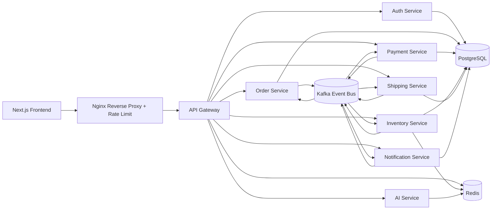

# System Design Defense Q&A - TechSphere E-Commerce

Tài liệu này dùng để trả lời khi bảo vệ kiến trúc hệ thống. Mỗi mục gồm: câu trả lời ngắn, bằng chứng trong source code/config, ưu/nhược điểm và câu hỏi thực tế có thể bị hỏi.

## 1. Tóm tắt kiến trúc đã chọn

Hệ thống chọn kiến trúc Microservices kết hợp Event-Driven Architecture. Frontend Next.js gọi API Gateway. API Gateway xác thực JWT, rate limit, proxy request tới các service nghiệp vụ. Các service chính gồm Auth, Order, Payment, Inventory, Shipping, Notification và AI Service. Các service giao tiếp đồng bộ qua HTTP khi cần truy vấn trực tiếp, và giao tiếp bất đồng bộ qua Kafka cho luồng xử lý đơn hàng.

Luồng tổng quát:



Bằng chứng:

| Hạng mục | Nơi chứng minh |
| --- | --- |
| Docker chạy toàn hệ thống | `docker-compose.yml`, `backend/docker-compose.yml` |
| Reverse proxy, edge rate limit | `nginx/default.conf` |
| API Gateway, proxy, JWT, rate limit, circuit breaker | `backend/api-gateway/src/index.ts` |
| Config timeout, retry, rate limit | `backend/api-gateway/src/config/index.ts` |
| Kafka event bus | `backend/shared/src/kafka/client.ts`, các `handlers` trong từng service |
| Event store/audit | `backend/*-service/src/lib/event-store.ts` |
| Redis cache inventory | `backend/inventory-service/src/lib/cache.ts` |
| AI assistant/agent | `backend/ai-service/src/index.ts`, `frontend/src/components/layout/ai-chat-box.tsx` |
| Watchdog auto restart | `ops/docker-watchdog/watchdog.sh`, `docker-compose.yml` |
| Diagram | `Diagram/*.mmd`, `Images/*.png` |

## 2. Vì sao chọn Microservices + Event-Driven?

Trả lời ngắn:

Hệ thống e-commerce có nhiều domain độc lập: user/auth, order, payment, inventory, shipping, notification, AI. Mỗi domain có lifecycle và lỗi riêng. Microservices giúp tách trách nhiệm, dễ scale riêng từng service. Event-driven giúp các bước sau khi đặt hàng như giữ tồn kho, thanh toán, vận chuyển, gửi thông báo không bị phụ thuộc cứng vào một request HTTP duy nhất.

Ví dụ luồng đặt hàng:

1. User tạo đơn qua Frontend.
2. API Gateway xác thực JWT và chuyển request tới Order Service.
3. Order Service tạo order `PENDING`, publish event `ORDER_PLACED`.
4. Inventory Service nhận event, reserve stock, publish `STOCK_RESERVED`.
5. Payment Service xử lý payment intent/webhook, publish payment event.
6. Shipping Service tạo shipment khi order đủ điều kiện.
7. Notification Service gửi thông báo.
8. Frontend đọc trạng thái/timeline qua API và SSE.

Bằng chứng:

| Ý | Nơi chứng minh |
| --- | --- |
| Order routes | `backend/order-service/src/routes/order.routes.ts` |
| Inventory handler | `backend/inventory-service/src/handlers/inventory.handler.ts` |
| Payment handler/routes | `backend/payment-service/src/handlers/payment.handler.ts`, `backend/payment-service/src/routes/payment.routes.ts` |
| Shipping handler | `backend/shipping-service/src/handlers/shipping.handler.ts` |
| Notification handler | `backend/notification-service/src/handlers/notification.handler.ts` |
| Event types | `backend/shared/src/types/events.ts` |

### 2.1. Các design patterns đang sử dụng

Trả lời ngắn:

Dự án không chỉ dùng một pattern đơn lẻ mà kết hợp nhiều pattern phù hợp với microservices: API Gateway/Proxy để gom entrypoint, Event-Driven Pub/Sub để tách service, Saga Choreography để điều phối order workflow, Repository để tách data access, Circuit Breaker để chống lỗi dây chuyền, Idempotency để tránh xử lý trùng request/event, Event Store để audit/replay, và Dead Letter Queue để giữ lại event lỗi sau khi retry thất bại.

Bằng chứng:

| Pattern | Đang dùng ở đâu | Vai trò |
| --- | --- | --- |
| API Gateway | `backend/api-gateway/src/index.ts` | Gateway xác thực JWT, rate limit, proxy request tới service nội bộ. |
| Proxy / Reverse Proxy | `nginx/default.conf`, `http-proxy-middleware` trong gateway | Nginx nhận traffic ngoài, gateway proxy tới từng service. |
| Event-Driven / Pub-Sub / Observer | `backend/shared/src/events/event-bus.ts`, `backend/shared/src/types/events.ts` | Service publish/subscribe event qua Kafka/Redis theo topic/channel. |
| Saga Pattern - choreography | `backend/order-service/src/handlers/order.handler.ts` | Order nghe `STOCK_RESERVED`, `PAYMENT_PROCESSED`, failure event để confirm/cancel order. |
| Compensating Transaction | `cancelOrder()` trong `backend/order-service/src/handlers/order.handler.ts`, refund/release flow ở payment/inventory | Khi payment hoặc stock lỗi, hệ thống phát event bù để rollback nghiệp vụ. |
| Repository Pattern | `backend/*-service/src/models/*.repository.ts` | Route/handler không gọi Prisma trực tiếp mà đi qua repository. |
| Singleton | `backend/*-service/src/lib/prisma.ts` | Mỗi service dùng một Prisma client dùng chung, tránh tạo connection lặp. |
| Circuit Breaker | `backend/api-gateway/src/index.ts`, `backend/shared/src/utils/index.ts`, `backend/payment-service/src/handlers/payment.handler.ts` | Ngắt tạm thời khi upstream/external gateway lỗi liên tục. |
| Middleware | Auth/rate limit/idempotency trong gateway và service routes | Tách logic xác thực, phân quyền, rate limit, idempotency khỏi business handler. |
| Adapter/Abstraction | `IEventBus`, `KafkaEventBus`, `RedisEventBus` trong `backend/shared/src/events/event-bus.ts` | Service phụ thuộc interface event bus, có thể đổi Redis/Kafka mà ít đổi business code. |
| Factory/Helper | `createEvent()` trong `backend/shared/src/events/event-bus.ts` | Chuẩn hóa event id, type, source, timestamp, correlationId. |
| Event Store | `backend/shared/src/events/event-store.ts`, `backend/*-service/src/lib/event-store.ts` | Lưu event để audit, xem timeline, có nền tảng replay. |
| Dead Letter Queue | `sendToDlq()`, `publishToDlq()` trong `backend/shared/src/events/event-bus.ts` | Event xử lý lỗi sau retry được đưa vào topic/channel DLQ. |

Câu hỏi thực tế:

**Pattern quan trọng nhất trong luồng đặt hàng là gì?**  
Saga Choreography kết hợp Event-Driven. Order Service không gọi cứng Inventory, Payment, Shipping theo chuỗi đồng bộ. Thay vào đó Order phát `ORDER_PLACED`; Inventory, Payment, Shipping, Notification tự xử lý và phát event tiếp theo. Order handler nghe các event thành công/thất bại để chuyển trạng thái.

**Vì sao cần Repository Pattern?**  
Repository giúp cô lập logic truy cập database. Route/handler chỉ nói về nghiệp vụ như tạo order, reserve stock, update payment status; chi tiết Prisma nằm trong `*.repository.ts`. Khi đổi query hoặc thêm transaction/index, phạm vi sửa nhỏ hơn.

### 2.2. CQRS trong dự án

Trả lời ngắn:

Dự án đang áp dụng CQRS ở mức logic service/API, chưa phải CQRS production đầy đủ với hai database read/write tách biệt. Command là các API thay đổi trạng thái và phát event, ví dụ tạo order, cập nhật payment, reserve stock. Query là các API đọc danh sách, chi tiết, thống kê, timeline. Việc tách command/query giúp code rõ trách nhiệm hơn và phù hợp với event-driven workflow.

Bằng chứng:

| CQRS | Ví dụ trong source | Giải thích |
| --- | --- | --- |
| Command - tạo order | `POST /api/orders` trong `backend/order-service/src/routes/order.routes.ts` | Ghi order `PENDING`, append event store, publish `ORDER_PLACED`. |
| Command - xử lý event | `backend/inventory-service/src/handlers/inventory.handler.ts`, `backend/payment-service/src/handlers/payment.handler.ts` | Consumer nhận event và cập nhật state nghiệp vụ. |
| Command - admin update status | `PATCH /api/orders/:id/status` trong `order.routes.ts` | Thay đổi trạng thái order và đồng bộ payment/shipping liên quan. |
| Query - list/detail order | `GET /api/orders`, `GET /api/orders/:id` trong `order.routes.ts` | Chỉ đọc dữ liệu từ repository, không phát event. |
| Query - stats | `getStats()` trong `backend/order-service/src/models/order.repository.ts` | Tối ưu cho đọc thống kê. |
| Query - event timeline | `GET /api/orders/:id/events` trong `order.routes.ts` | Đọc event store để hiển thị timeline xử lý đơn hàng. |

Khi bảo vệ nên nói rõ:

Hiện tại CQRS tách theo intent và code path: write path xử lý command/event, read path xử lý query. Hệ thống chưa tách riêng read model database như Elasticsearch/read replica/materialized view. Nếu lên production hoặc traffic đọc lớn, có thể mở rộng bằng read model riêng cho order summary, dashboard và tracking timeline.

### 2.3. Event Sourcing trong dự án

Trả lời ngắn:

Dự án có Event Store và lưu domain event cho audit/timeline/replay foundation, nhưng chưa phải full Event Sourcing tuyệt đối. Trạng thái hiện tại của order/payment/inventory vẫn được lưu trong PostgreSQL qua repository. Event store đóng vai trò audit log và nguồn lịch sử sự kiện; nếu cần production-grade event sourcing thì phải đảm bảo mọi state có thể rebuild hoàn toàn từ event stream, version event schema và snapshot.

Bằng chứng:

| Thành phần | Nơi chứng minh | Vai trò |
| --- | --- | --- |
| Interface event store | `backend/shared/src/events/event-store.ts` | Có `append`, `getEvents`, `getEventsByType`, `getAllEvents`. |
| Prisma event store | `backend/*-service/src/lib/event-store.ts` | Lưu event vào PostgreSQL theo từng service. |
| Append khi tạo order | `eventStore.append(event)` trong `backend/order-service/src/routes/order.routes.ts` | Ghi `ORDER_PLACED` trước/sau khi publish event. |
| Append khi consume event | `eventStore.append(event)` trong `backend/*-service/src/handlers/*.handler.ts` | Mỗi service lưu event đã xử lý để audit. |
| Timeline API | `GET /api/orders/:id/events` trong `order.routes.ts` | Cho frontend/admin xem lịch sử xử lý order. |

Câu hỏi thực tế:

**Event Sourcing khác Event Store/Audit Log thế nào?**  
Event Store/Audit Log chỉ lưu lại lịch sử sự kiện để tra cứu. Full Event Sourcing xem event là nguồn dữ liệu chính: state hiện tại được rebuild bằng cách replay event. Dự án hiện dùng hướng hybrid: state chính vẫn ở PostgreSQL, event store phục vụ audit/timeline và là nền tảng để mở rộng replay.

**Vì sao không dùng full Event Sourcing ngay?**  
Full Event Sourcing tăng độ phức tạp: cần event versioning, snapshot, migration event schema, replay idempotent và xử lý projection. Với scope đồ án, hybrid event store đủ để chứng minh event-driven, audit và timeline mà vẫn dễ vận hành.

### 2.4. Dead Letter Queue

Trả lời ngắn:

Dead Letter Queue dùng để không làm mất event khi handler xử lý lỗi nhiều lần. EventBus retry handler với exponential backoff; nếu vẫn lỗi sau số lần retry cấu hình, event được đưa vào DLQ để dev/admin kiểm tra, sửa lỗi rồi reprocess thủ công hoặc bằng job riêng.

Bằng chứng:

| Cơ chế | Nơi chứng minh |
| --- | --- |
| Retry handler Kafka | `handleWithRetry()` trong `KafkaEventBus` tại `backend/shared/src/events/event-bus.ts` |
| Kafka DLQ topic | `sendToDlq()` gửi tới topic `<topic>.dlq` |
| Retry handler Redis | `handleWithRetry()` trong `RedisEventBus` |
| Redis DLQ channel | `publishToDlq()` gửi tới channel `dlq:<channel>` |
| Config retry Kafka | `KAFKA_MAX_RETRIES`, `KAFKA_RETRY_BASE_MS` |
| Config retry Redis | `REDIS_EVENT_MAX_RETRIES`, `REDIS_EVENT_RETRY_BASE_MS`, `REDIS_DLQ_PREFIX` |
| Tài liệu Kafka/DLQ | `backend/shared/README.kafka.md` |

Câu hỏi thực tế:

**Nếu Inventory handler lỗi khi xử lý `ORDER_PLACED` thì sao?**  
EventBus retry theo cấu hình. Nếu lỗi tạm thời như timeout DB/Redis thì retry có thể thành công. Nếu lỗi logic hoặc dữ liệu hỏng khiến retry vẫn fail, event được đưa vào DLQ. Khi đó order có thể ở trạng thái pending/failed tùy flow, và admin/dev cần đọc DLQ, sửa nguyên nhân, rồi reprocess event.

**DLQ có thay thế monitoring không?**  
Không. DLQ chỉ giữ lại message lỗi để không mất dữ liệu. Production vẫn cần alert khi DLQ tăng, dashboard theo số lượng DLQ, tool replay và quy trình xử lý thủ công.

## 3. Ưu điểm và nhược điểm của kiến trúc

Ưu điểm:

| Ưu điểm | Giải thích |
| --- | --- |
| Tách domain rõ | Mỗi service xử lý một nghiệp vụ, dễ bảo trì hơn khi hệ thống lớn. |
| Scale độc lập | Inventory hoặc API Gateway có thể scale riêng nếu traffic cao. |
| Fault isolation | Payment lỗi không nhất thiết làm toàn bộ hệ thống chết; gateway có circuit breaker và service có healthcheck. |
| Dễ audit | Event store lưu event giúp xem timeline xử lý đơn hàng. |
| Phù hợp nghiệp vụ order | Đặt hàng là luồng nhiều bước, dùng event giúp giảm coupling. |
| Dễ tích hợp AI | AI Service là service riêng, không ảnh hưởng core order/payment khi AI lỗi. |

Nhược điểm:

| Nhược điểm | Cách giảm thiểu trong dự án |
| --- | --- |
| Phức tạp hơn monolith | Dùng Docker Compose, shared package, diagram và API Gateway để gom entrypoint. |
| Debug khó hơn | Có `/health`, event timeline, event store, logs từng service. |
| Eventual consistency | Trạng thái order/payment/shipping có thể cập nhật lệch vài giây; UI hiển thị timeline và polling/SSE. |
| Tốn tài nguyên hơn | Nhiều container Node.js, Kafka, Redis, PostgreSQL; phù hợp demo/learning, production cần sizing. |
| Cần quản lý network/security | Nên chỉ expose Nginx 80/443 ra internet, các port service nội bộ không public. |

## 4. So sánh với kiến trúc khác

### So với Monolith

Monolith đơn giản hơn để code ban đầu, deploy một app là chạy. Nhưng khi hệ thống có order, payment, inventory, shipping, notification, AI thì code dễ dính chặt, một lỗi payment có thể ảnh hưởng toàn app, và scale phải scale cả hệ thống dù chỉ một module bị tải cao.

Lý do không chọn monolith làm kiến trúc chính:

| Tiêu chí | Monolith | Kiến trúc hiện tại |
| --- | --- | --- |
| Độ đơn giản | Cao lúc đầu | Phức tạp hơn |
| Scale riêng từng module | Khó | Có thể scale từng service |
| Fault isolation | Thấp hơn | Tốt hơn |
| Phù hợp event order workflow | Cần tự quản trong cùng app | Kafka/event handlers tự nhiên hơn |
| Chi phí vận hành | Thấp hơn | Cao hơn |

### So với Microservices chỉ dùng REST đồng bộ

REST-only dễ hiểu nhưng luồng order sẽ bị chain call: Order gọi Inventory, rồi Payment, rồi Shipping, rồi Notification. Nếu một service chậm, request gốc dễ timeout. Event-driven giảm coupling: Order Service chỉ publish event, các service khác xử lý theo khả năng.

Trade-off là dữ liệu không còn consistent ngay lập tức; hệ thống dùng event timeline để minh bạch trạng thái.

### So với Serverless

Serverless giảm quản lý server và scale tốt với burst traffic, nhưng khó demo local đầy đủ, cold start, quản lý event flow/phụ thuộc phức tạp hơn. Với bài này Docker Compose + microservices phù hợp vì dễ chạy toàn hệ thống trên EC2 và chứng minh kiến trúc.

## 5. Trade-off

| Khía cạnh | Lợi ích | Đánh đổi |
| --- | --- | --- |
| Hiệu năng | Redis cache, async event, API Gateway timeout giúp hệ thống phản hồi ổn hơn | Kafka/Redis/Postgres làm tăng network hop |
| Chi phí | Có thể scale đúng service cần thiết | Nhiều container tốn RAM/CPU hơn monolith |
| Độ phức tạp | Tách domain rõ, dễ mở rộng dài hạn | Cần quản lý service discovery, logs, healthcheck, event consistency |
| Khả năng mở rộng | Có thể horizontal scale service stateless và đặt load balancer | DB/Kafka cần cấu hình production kỹ hơn |
| Availability | restart policy, healthcheck, watchdog, circuit breaker | Cần giám sát để tránh restart loop và phát hiện lỗi gốc |

## 6. Availability - giảm downtime

Trả lời ngắn:

Hệ thống có nhiều lớp đảm bảo availability: Docker healthcheck, `restart: unless-stopped`, watchdog tự restart service bị chết/unhealthy, API Gateway có circuit breaker để tránh gọi service đang lỗi, Nginx làm reverse proxy entrypoint.

Bằng chứng:

| Cơ chế | Nơi chứng minh |
| --- | --- |
| Docker restart policy | `restart: unless-stopped` trong `docker-compose.yml` |
| Healthcheck mỗi service | `healthcheck` trong `docker-compose.yml` |
| Watchdog restart tối đa 3 lần/30 phút | `ops/docker-watchdog/watchdog.sh` |
| Circuit breaker | `recordServiceFailure`, `createCircuitGuard` trong `backend/api-gateway/src/index.ts` |
| Gateway health endpoint | `/api/health`, `/health` trong `backend/api-gateway/src/index.ts` |

Câu hỏi thực tế:

**Nếu một service đột ngột sập thì sao?**  
Docker restart policy sẽ cố khởi động lại. Nếu container bị unhealthy hoặc chết, watchdog kiểm tra mỗi 30 giây. Nếu trong 30 phút restart 3 lần vẫn không ổn, watchdog dừng restart để tránh vòng lặp gây tốn tài nguyên. Gateway trả `503` hoặc `504` cho service lỗi thay vì treo toàn hệ thống.

**Nếu API Gateway sập thì sao?**  
Docker restart policy và watchdog khởi động lại. Trong production nên chạy nhiều instance API Gateway sau Nginx/ALB để tránh single point of failure.

**Nếu Kafka sập thì sao?**  
Các luồng event bị gián đoạn, nhưng service HTTP vẫn có thể trả lỗi hoặc degraded tùy chức năng. Production nên dùng Kafka cluster nhiều broker, replication factor > 1. Demo hiện dùng 1 broker nên vẫn là điểm yếu cần nói thẳng.

## 7. Performance - Redis caching

Trả lời ngắn:

Redis được dùng để tăng hiệu năng cho dữ liệu đọc nhiều và dữ liệu tạm thời. Inventory Service cache thông tin sản phẩm theo `productId`. API Gateway dùng Redis làm store cho rate limiter để nhiều instance gateway có thể chia sẻ bộ đếm. AI Service dùng Redis lưu lịch sử chat ngắn hạn.

Bằng chứng:

| Use case Redis | Nơi chứng minh |
| --- | --- |
| Cache 1 object inventory | `backend/inventory-service/src/lib/cache.ts` |
| `GET` cache object | `getCachedInventoryProduct(productId)` |
| `SET` cache object TTL 60s | `setCachedInventoryProduct(productId, item)` |
| `DEL` cache object | `deleteCachedInventoryProduct(productId)` |
| Rate limit store | `RedisStore` trong `backend/api-gateway/src/index.ts` |
| AI chat history TTL 30 phút | `redisClient.setex(redisKey, 1800, ...)` trong `backend/ai-service/src/index.ts` |

Câu trả lời khi bị hỏi “Redis CRUD 1 object ở đâu?”:

Inventory cache là ví dụ rõ nhất. Key có dạng `inventory:product:<productId>`. Khi đọc sản phẩm, service có thể lấy từ Redis trước. Khi cập nhật tồn kho, service xóa hoặc cập nhật cache để tránh dữ liệu cũ. TTL 60 giây giúp cache tự hết hạn.

## 8. Fault Tolerance

Trả lời ngắn:

Hệ thống chịu lỗi bằng các lớp: retry health check 3s/5s, timeout khi gọi service, circuit breaker, Docker healthcheck, watchdog restart, event-driven để giảm coupling giữa các service, idempotency để tránh xử lý trùng, và Dead Letter Queue để giữ lại event lỗi sau khi retry thất bại.

Bằng chứng:

| Cơ chế | Nơi chứng minh |
| --- | --- |
| Retry 3s/5s | `HEALTH_RETRY_DELAYS_MS: 3000,5000` trong compose và config gateway |
| Timeout gọi health | `fetchWithTimeout` trong `backend/api-gateway/src/index.ts` |
| Circuit breaker | `serviceStates`, `recordServiceFailure`, `createCircuitGuard` |
| Docker healthcheck | `docker-compose.yml` |
| Watchdog | `ops/docker-watchdog/watchdog.sh` |
| Kafka event bus | `backend/shared/src/kafka/client.ts` |
| Event retry + DLQ | `handleWithRetry()`, `sendToDlq()`, `publishToDlq()` trong `backend/shared/src/events/event-bus.ts` |
| Idempotency | `createIdempotencyMiddleware`, `IdempotencyStore`, `RedisIdempotencyStore` trong `backend/shared/src/utils` |

Câu hỏi thực tế:

**Nếu Payment Service timeout khi user thanh toán thì sao?**  
Gateway trả `504 UPSTREAM_TIMEOUT`. Sau nhiều lỗi liên tiếp, circuit breaker mở và tạm thời không gọi Payment Service nữa. Payment webhook/event có thể cập nhật trạng thái sau khi service phục hồi.

**Nếu service trả HTTP 500 liên tục thì sao?**  
Gateway tăng failure count. Khi vượt threshold, circuit mở trong một khoảng thời gian để bảo vệ hệ thống khỏi gọi tiếp service đang lỗi.

**Nếu event handler lỗi liên tục thì sao?**  
EventBus retry handler theo cấu hình. Nếu vẫn lỗi sau số lần retry tối đa, event được gửi vào DLQ (`<topic>.dlq` với Kafka hoặc `dlq:<channel>` với Redis). Nhờ vậy event lỗi không bị mất và có thể được điều tra/reprocess sau.

## 9. Rate Limiter

### Client-side rate limiter

Trả lời ngắn:

Frontend có client-side rate limiter nhẹ trong API client để hạn chế spam request từ browser trước khi request đi tới server. Các endpoint nhạy cảm như login/register, forgot/reset password, AI chat, tạo order, payment có limit thấp hơn request thường. Ngoài ra UI cũng disable button khi request đang xử lý để tránh double-submit.

Bằng chứng:

| Cơ chế | Nơi chứng minh |
| --- | --- |
| Client rate limit bucket | `frontend/src/lib/api.ts` |
| Rule cho auth/AI/order/payment | `getClientRateLimitRule` trong `frontend/src/lib/api.ts` |
| Check trước khi fetch | `assertClientRateLimit(path, method)` trong `frontend/src/lib/api.ts` |
| Disable AI submit khi loading | `frontend/src/components/layout/ai-chat-box.tsx` |
| Disable checkout/payment khi pending | `frontend/src/app/(main)/cart/page.tsx` |

Lưu ý khi trả lời:

Client-side limiter chỉ giúp UX và giảm spam vô tình. Không được xem là lớp bảo mật chính vì client có thể bị bypass. Lớp bảo vệ chính vẫn là Nginx và API Gateway.

### Server/API Gateway rate limiter

Trả lời ngắn:

API Gateway dùng `express-rate-limit` với Redis store. Redis giúp bộ đếm rate limit dùng chung được khi scale nhiều gateway instance. Có limiter tổng quát và limiter riêng cho auth, tạo order, payment, AI.

Bằng chứng:

| Limiter | Nơi chứng minh |
| --- | --- |
| General API limiter | `generalApiLimiter` trong `backend/api-gateway/src/index.ts` |
| Create order limiter | `createOrderLimiter` |
| Auth limiter | `sensitiveAuthLimiter` |
| Payment limiter | `paymentLimiter` |
| AI limiter | `aiLimiter` |
| Config env | `backend/api-gateway/src/config/index.ts`, compose env |

### Edge/Nginx rate limiter

Trả lời ngắn:

Nginx giới hạn request ở cửa ngoài trước khi request vào Node.js. `/api/` có rate thấp hơn web page, và mỗi IP bị giới hạn số connection.

Bằng chứng:

| Cơ chế | Nơi chứng minh |
| --- | --- |
| API rate 10r/s/IP | `limit_req_zone ... api_per_ip ... rate=10r/s` trong `nginx/default.conf` |
| Web rate 30r/s/IP | `limit_req_zone ... web_per_ip ... rate=30r/s` |
| Connection limit | `limit_conn conn_per_ip 30` |

Câu hỏi thực tế:

**Nếu người dùng spam login thì sao?**  
Client limiter chặn một phần ở browser. Nếu bypass client, API Gateway auth limiter chặn bằng Redis. Nếu spam từ nhiều request vào Nginx, Nginx cũng có rate limit theo IP.

**Nếu bị DDoS lớn thì đủ không?**  
Không. Nginx/gateway rate limit chỉ bảo vệ ở mức ứng dụng. DDoS lớn cần AWS WAF, Shield, CloudFront/CDN, ALB, security group và autoscaling.

## 10. Security - JWT authentication/authorization

Trả lời ngắn:

Auth Service phát JWT access/refresh token. Frontend lưu session và gửi `Authorization: Bearer <token>`. API Gateway verify JWT, sau đó forward user context qua headers `x-user-id`, `x-user-email`, `x-user-role`, `x-user-name` cho downstream services. Các service downstream dùng middleware kiểm tra user/role.

Bằng chứng:

| Cơ chế | Nơi chứng minh |
| --- | --- |
| Token helper | `backend/auth-service/src/lib/tokens.ts` |
| Auth routes | `backend/auth-service/src/index.ts` |
| Gateway verify JWT | `gatewayAuthMiddleware` trong `backend/api-gateway/src/index.ts` |
| Forward user headers | `req.headers["x-user-id"] = decoded.id` trong gateway |
| Downstream auth middleware | `backend/order-service/src/middleware/auth.middleware.ts` |
| Frontend gửi Bearer token | `fetchApi` trong `frontend/src/lib/api.ts` |
| Route guard frontend | `frontend/src/components/layout/auth-guard.tsx`, `frontend/src/middleware.ts` |

Câu hỏi thực tế:

**Vì sao không để từng service tự verify JWT?**  
Có thể làm, nhưng ở dự án này gateway là entrypoint chính nên verify tại gateway giúp tập trung logic auth và giảm lặp code. Downstream service vẫn kiểm tra header user/role để authorization. Production nên bảo đảm service nội bộ không public trực tiếp ra internet, nếu không attacker có thể giả header.

**JWT hết hạn thì sao?**  
Frontend có flow refresh token. Nếu refresh lỗi hoặc token không hợp lệ, session bị clear và user được redirect về `/auth`.

## 11. Scalability

Trả lời ngắn:

Hệ thống có thể scale ngang các service stateless như API Gateway, frontend, inventory read, notification worker, AI Service. Nginx hoặc AWS ALB có thể làm load balancer. Redis store giúp rate limit hoạt động đúng khi có nhiều gateway instance. Kafka giúp scale consumer theo consumer group.

Hướng scale:

| Mức | Cách làm |
| --- | --- |
| Vertical scale | Tăng CPU/RAM EC2 khi còn nhỏ |
| Horizontal scale trong Docker | Chạy nhiều replica service stateless, bỏ publish port cố định cho service nội bộ |
| Load balancer | Nginx upstream hoặc AWS ALB |
| DB scale | Connection pool, index, read replica, backup |
| Cache scale | Redis cache, TTL, cache invalidation |
| Event scale | Kafka nhiều broker, partition topic theo orderId/customerId |

Câu hỏi thực tế:

**Traffic tăng gấp 10 thì làm gì?**  
Đầu tiên xem bottleneck bằng monitoring. Nếu nghẽn ở API Gateway/frontend thì scale nhiều instance sau Nginx/ALB. Nếu nghẽn inventory read thì tăng cache Redis và scale Inventory Service. Nếu nghẽn DB thì thêm index, connection pool, read replica. Nếu nghẽn xử lý async thì tăng consumer instances và Kafka partitions.

**Load balancer có giúp tăng truy cập không?**  
Có, nhưng load balancer chỉ phân phối tải. Muốn tăng sức chịu tải phải có nhiều instance phía sau. Với AWS nên dùng ALB trước nhiều EC2/container. Với Docker single EC2 có thể dùng Nginx upstream và `docker compose --scale`, nhưng cần không publish trùng port host cho service được scale.

## 12. Maintainability

Trả lời ngắn:

Project tách rõ theo service và layer: config, routes, handlers, models/repository, lib, shared types. Shared package chứa Kafka utilities và event types dùng chung. Mỗi service có Dockerfile riêng, Prisma schema riêng, config riêng.

Bằng chứng:

| Hạng mục | Nơi chứng minh |
| --- | --- |
| Service folders | `backend/auth-service`, `backend/order-service`, `backend/payment-service`, ... |
| Shared types/utils | `backend/shared/src` |
| Routes | `backend/*-service/src/routes` |
| Handlers | `backend/*-service/src/handlers` |
| Repositories/models | `backend/*-service/src/models` |
| Config riêng | `backend/*-service/src/config/index.ts` |
| Frontend pages/components/lib | `frontend/src/app`, `frontend/src/components`, `frontend/src/lib` |

Câu hỏi thực tế:

**Nếu thêm Loyalty Service thì làm thế nào?**  
Tạo `backend/loyalty-service`, định nghĩa DB schema, route/handler, Dockerfile, thêm service vào compose, thêm URL vào API Gateway nếu cần REST, thêm event consumer nếu cần nghe `ORDER_CONFIRMED` hoặc `PAYMENT_COMPLETED`.

## 13. Docker Compose

Trả lời ngắn:

Docker Compose chạy toàn bộ hệ thống gồm frontend, nginx, api-gateway, các backend services, PostgreSQL, Redis, Kafka, Zookeeper và watchdog. Các service có healthcheck và dependency condition để giảm lỗi khởi động sai thứ tự.

Bằng chứng:

| Hạng mục | Nơi chứng minh |
| --- | --- |
| Root compose | `docker-compose.yml` |
| Backend compose | `backend/docker-compose.yml` |
| Service healthcheck | các block `healthcheck` trong compose |
| Restart policy | `restart: unless-stopped` |
| Watchdog service | service `watchdog` trong compose |

Lệnh chạy:

```bash
docker compose up -d --build
docker compose ps
docker compose logs -f api-gateway
docker compose logs -f watchdog
```

## 14. AI Application và AI Agent

Trả lời ngắn:

AI được áp dụng vào bài toán tư vấn mua sắm thực tế. AI Service lấy dữ liệu inventory hiện tại, nhận context giỏ hàng, dùng Gemini để trả lời theo structured JSON, gợi ý sản phẩm và có `agent_action`. Nếu user có ý định mua rõ ràng, agent có thể trả action `ADD_TO_CART`, frontend nhận action và tự thêm sản phẩm vào giỏ.

Bằng chứng:

| Hạng mục | Nơi chứng minh |
| --- | --- |
| AI Service endpoint | `POST /api/ai/chat` trong `backend/ai-service/src/index.ts` |
| In-context inventory data | `fetchInventoryProducts()` trong AI Service |
| Structured output schema | `responseSchema` trong AI Service |
| Agent action | `agent_action.type = ADD_TO_CART` |
| Fallback khi Gemini lỗi/quota | `generateMockResponse()` |
| Redis chat history | `ai:chat:history:<session_id>` TTL 1800s |
| Frontend xử lý action | `frontend/src/components/layout/ai-chat-box.tsx` |

Câu hỏi thực tế:

**AI Agent khác chatbot thường ở điểm nào?**  
Chatbot chỉ trả lời text. Agent trong dự án có thể trả về hành động có cấu trúc `ADD_TO_CART`. Frontend đọc action đó và thực hiện thay user. Hệ thống cũng có guardrails: chỉ gợi ý sản phẩm tồn tại trong inventory, giới hạn số lượng, fallback khi AI lỗi.

**Nếu AI Service lỗi thì hệ thống mua hàng có chết không?**  
Không. AI Service là service riêng. Core flow như xem sản phẩm, đặt hàng, thanh toán vẫn chạy. Gateway có limiter/circuit breaker cho `/api/ai`, frontend hiển thị lỗi mềm nếu AI không trả lời.

## 15. Các câu hỏi tình huống thực tế

### Hỏi: Nếu max lượt truy cập server thì làm gì?

Trả lời:

Trước hết hệ thống trả `429` nhờ rate limiter để bảo vệ tài nguyên. Sau đó cần xác định bottleneck: CPU, RAM, network, DB connection, Redis, Kafka hay external API. Nếu nghẽn web/API thì scale nhiều instance sau Nginx/ALB. Nếu nghẽn DB thì tối ưu query, index, connection pool, read replica. Nếu request tĩnh nhiều thì đưa qua CDN. Nếu tác vụ nặng thì chuyển sang queue/event để xử lý async.

### Hỏi: Nếu một service bị downtime thì user thấy gì?

Trả lời:

Gateway trả lỗi rõ ràng `503 SERVICE_CIRCUIT_OPEN`, `503 UPSTREAM_UNAVAILABLE` hoặc `504 UPSTREAM_TIMEOUT`, không để request treo. Watchdog/Docker tự restart service. Với event-driven flow, những phần async có thể tiếp tục sau khi service phục hồi.

### Hỏi: Event-driven có bị mất event không?

Trả lời:

Kafka bền hơn HTTP direct call vì message được lưu trong topic. Tuy nhiên demo dùng 1 broker nên chưa đạt production HA. Production cần multi-broker, replication factor, idempotent handlers và retry/dead-letter topic.

### Hỏi: Dự án có dùng CQRS không?

Trả lời:

Có, ở mức tách command/query theo code path. Các command như `POST /api/orders`, payment webhook, inventory reserve sẽ ghi dữ liệu và phát event. Các query như `GET /api/orders`, `GET /api/orders/:id`, stats và timeline chỉ đọc dữ liệu. Hiện chưa tách read database/write database riêng; nếu traffic lớn có thể thêm read model/materialized view cho order summary và dashboard.

### Hỏi: Dự án có dùng Event Sourcing không?

Trả lời:

Có Event Store cho domain event, audit trail và timeline, nhưng là hybrid/partial event sourcing. Trạng thái hiện tại vẫn được lưu trong PostgreSQL qua repository. Full event sourcing production cần event là source of truth duy nhất, replay để rebuild state, event versioning, snapshot và projection riêng.

### Hỏi: Dead Letter Queue dùng để làm gì?

Trả lời:

DLQ giữ lại event không xử lý được sau khi retry. Trong code, Kafka event lỗi được gửi tới `<topic>.dlq`, Redis event lỗi được gửi tới `dlq:<channel>`. DLQ giúp không mất message và tạo điểm điều tra/reprocess, nhưng production vẫn cần alert, dashboard và quy trình xử lý DLQ.

### Hỏi: Làm sao tránh đặt hàng trừ kho sai?

Trả lời:

Inventory Service chịu trách nhiệm reserve stock, không để Order Service tự trừ kho. Event `ORDER_PLACED` kích hoạt reserve, sau đó publish `STOCK_RESERVED` hoặc failure event. Cần transaction ở DB và idempotency để tránh xử lý trùng event.

### Hỏi: Vì sao cần API Gateway?

Trả lời:

Gateway gom entrypoint cho frontend, xử lý JWT, CORS, rate limit, proxy, timeout, circuit breaker, health aggregation. Nếu frontend gọi trực tiếp từng service thì client phải biết nhiều URL, khó bảo mật, khó đổi service nội bộ.

### Hỏi: Vì sao cần Redis nếu đã có PostgreSQL?

Trả lời:

PostgreSQL là persistent database. Redis dùng cho dữ liệu tạm/thường đọc: cache inventory, rate limit counters, AI chat history. Redis giảm tải DB và có TTL tự hết hạn.

### Hỏi: Nếu payment webhook gửi trùng thì sao?

Trả lời:

Payment Service cần idempotency theo payment/order/transaction id. Trong dự án đã có luồng xử lý payment status và sync order/shipping sau webhook. Khi bảo vệ, nhấn mạnh webhook phải idempotent vì provider có thể retry.

### Hỏi: Nếu muốn deploy production thì cần cải thiện gì?

Trả lời:

Không expose trực tiếp các port service như `4000-4007`, `5432`, `6379`, `9092`. Chỉ expose `80/443` qua Nginx hoặc ALB. Chuyển secret sang AWS Secrets Manager/SSM, bật HTTPS, dùng managed PostgreSQL/Redis nếu có điều kiện, Kafka cluster/managed queue, logging/monitoring, backup DB và CI/CD.

## 16. Câu trả lời ngắn theo rubric

| Rubric | Câu trả lời |
| --- | --- |
| Architecture diagram | Có diagram trong `Diagram/*.mmd` và tổng thể là Client -> Nginx -> API Gateway -> Microservices -> Kafka/DB/Redis. |
| Advantages/disadvantages | Ưu: scale riêng, fault isolation, event audit. Nhược: phức tạp, eventual consistency, tốn tài nguyên. |
| Compare architecture | Tốt hơn monolith ở scale/fault isolation, phức tạp hơn. Tốt hơn REST-only cho order workflow async. |
| Trade-off | Đổi chi phí/độ phức tạp để lấy scalability, maintainability, availability. |
| Design patterns | API Gateway, Proxy, Pub/Sub, Saga Choreography, Repository, Singleton, Circuit Breaker, Middleware, Adapter, Idempotency, Event Store, DLQ. |
| CQRS | Tách command/query theo code path: command ghi state và phát event, query chỉ đọc repository/event timeline; chưa tách read/write database riêng. |
| Event Sourcing | Có event store/audit/timeline, nhưng là hybrid/partial; state hiện tại vẫn lưu trong PostgreSQL. |
| Dead Letter Queue | EventBus retry handler rồi đưa event lỗi vào Kafka `<topic>.dlq` hoặc Redis `dlq:<channel>`. |
| Availability | Docker healthcheck, restart policy, watchdog, circuit breaker, health endpoint. |
| Performance | Redis cache inventory object, Redis rate limit store, Redis AI chat history. |
| Fault tolerance | Retry health 3s/5s, timeout, circuit breaker, watchdog, event-driven, idempotency, DLQ. |
| Client rate limiter | `frontend/src/lib/api.ts` có client limiter; UI disable double-submit. |
| Retry 3-5s | `HEALTH_RETRY_DELAYS_MS=3000,5000` ở gateway config/compose. |
| Server rate limiter | API Gateway dùng `express-rate-limit` + RedisStore; Nginx limit ngoài cùng. |
| Security | JWT tại gateway, downstream nhận user headers và check role. |
| Scalability | Có hướng scale horizontal service stateless, Nginx/ALB load balancer, Redis/Kafka hỗ trợ scale. |
| Maintainability | Mỗi service có folder/layer riêng, shared types/events, Dockerfile riêng. |
| Docker Compose | `docker-compose.yml` chạy full stack. |
| Apply AI | AI tư vấn sản phẩm bằng inventory context. |
| Agent | Agent action `ADD_TO_CART` tự thêm vào giỏ hàng. |
