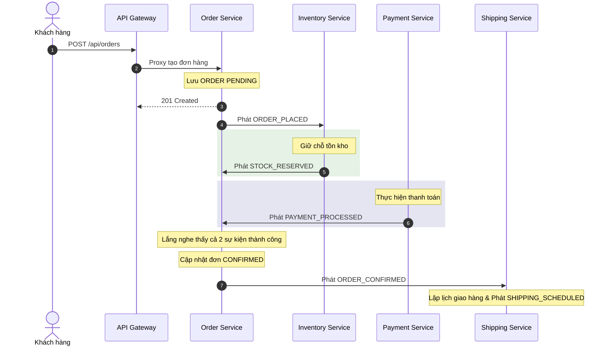

# Tài liệu Lý thuyết Kiến trúc: Hệ thống Xử lý Đơn hàng E-Commerce

Tài liệu này trình bày chi tiết các nguyên lý thiết kế, các mẫu thiết kế phần mềm (Design Patterns) và mô hình bảo mật áp dụng trong hệ thống Microservices xử lý đơn hàng E-Commerce.

---

## 1. Mô hình Microservices & API Gateway Pattern

### Kiến trúc Microservices
Hệ thống được chia nhỏ thành các dịch vụ độc lập, tự vận hành (self-contained), mỗi dịch vụ chịu trách nhiệm cho một miền nghiệp vụ duy nhất (Single Responsibility Principle):
* **Auth Service (`port 4006`)**: Quản lý định danh, đăng ký, đăng nhập, bảo mật phiên, và thông tin người dùng.
* **Order Service (`port 4001`)**: Chịu trách nhiệm quản lý vòng đời đơn hàng và trạng thái Saga.
* **Payment Service (`port 4002`)**: Xử lý thanh toán thẻ giả lập kết hợp với Circuit Breaker chống quá tải.
* **Inventory Service (`port 4003`)**: Quản lý hàng tồn kho, đặt giữ chỗ sản phẩm và lưu trữ danh mục sản phẩm.
* **Shipping Service (`port 4004`)**: Lập lịch trình vận chuyển và cập nhật trạng thái giao hàng.
* **Notification Service (`port 4005`)**: Gửi email/tin nhắn thông báo nghiệp vụ giả lập.

### API Gateway Pattern
API Gateway đóng vai trò là điểm truy cập duy nhất (Single Point of Entry) cho tất cả các máy khách (Next.js Frontend). Gateway thực hiện các chức năng cốt lõi:
1. **Routing / Proxying:** Sử dụng `http-proxy-middleware` để định tuyến các yêu cầu `/api/orders` tới Order Service, `/api/auth` tới Auth Service, v.v.
2. **Centralized JWT Validation & Security (Mới):** Thay vì mỗi dịch vụ hạ nguồn tự xác thực chữ ký JWT độc lập, API Gateway thực hiện giải mã JWT tập trung, ngăn chặn các yêu cầu không hợp lệ ngay tại biên mạng.
3. **Identity Forwarding (Mới):** Sau khi giải mã thành công, Gateway chuyển tiếp thông tin người dùng định danh (User Context) xuống microservices thông qua các custom HTTP Headers (`x-user-id`, `x-user-role`, v.v.). Điều này giúp các microservices hạ nguồn không cần phải kết nối trực tiếp với Database Auth hay giải mã lại token, tăng tính độc lập và hiệu suất.
4. **Rate Limiting:** Sử dụng Redis-backed rate limiting (`rate-limit-redis`) để hạn chế tấn công DoS/DDoS và bảo vệ hệ thống khỏi tình trạng quá tải yêu cầu.
5. **Circuit Breaker:** Ngăn ngừa lỗi lan chuyền (cascade failures). Khi một microservice hạ nguồn bị sập, Gateway sẽ mở mạch (Open Circuit), trả về ngay lỗi `503 Service Unavailable` thay vì để các luồng yêu cầu bị treo.

---

## 2. Event-Driven Architecture (EDA) & Saga Choreography Pattern

### Event-Driven Architecture (EDA)
Hệ thống sử dụng mô hình trao đổi thông tin bất đồng bộ (Asynchronous Communication) thông qua các Sự kiện Miền (Domain Events) thay vì gọi trực tiếp HTTP/gRPC. 
* **Hạ tầng:** Hỗ trợ linh hoạt **Kafka** (cho môi trường sản xuất có lưu vết bền vững) và **Redis Pub/Sub** (cho môi trường phát triển cục bộ gọn nhẹ).
* **Đặc tính cơ bản:** Loose Coupling (Các dịch vụ không cần biết nhau tồn tại) và Highly Scalable (Khả năng mở rộng tốt).

### Saga Choreography Pattern (Biên đạo Sự kiện)
Do áp dụng nguyên tắc **Database-per-Service** (Mỗi dịch vụ sở hữu cơ sở dữ liệu riêng), hệ thống không thể thực hiện giao dịch ACID truyền thống trên nhiều cơ sở dữ liệu. Thay vào đó, mẫu **Saga Choreography** được triển khai:
* Không có một bộ điều phối tập trung (Saga Orchestrator). Thay vào đó, mỗi microservice tự lắng nghe sự kiện từ bus và tự quyết định hành động tiếp theo, đồng thời phát ra sự kiện mới để kích hoạt dịch vụ kế tiếp.



### Compensating Transactions (Giao dịch bù trừ)
Nếu có bất kỳ lỗi nào xảy ra trong chuỗi (ví dụ: hết hàng hoặc thanh toán thất bại), hệ thống sẽ kích hoạt giao dịch bù trừ để hoàn trả dữ liệu về trạng thái nhất quán ban đầu (Eventual Consistency):
* **Hết hàng (`STOCK_RESERVATION_FAILED`):** Order Service chuyển trạng thái đơn hàng thành `CANCELLED`.
* **Thanh toán lỗi (`PAYMENT_FAILED`):** Order Service chuyển trạng thái đơn thành `CANCELLED`, đồng thời phát sự kiện `ORDER_CANCELLED`. Inventory Service lắng nghe `ORDER_CANCELLED` để **giải phóng tồn kho đã giữ** (Compensating Transaction). Payment Service sẽ **hoàn tiền** nếu trước đó đã trích tiền thành công.

---

## 3. Distributed JWT Security & Identity Forwarding

Mô hình bảo mật phân tán hoạt động theo nguyên tắc **Zero Trust** bên trong mạng nội bộ nội bộ kết hợp xác thực tập trung ở biên mạng:

```
[Máy khách (Next.js)] 
       │
       ▼ (Bearer JWT)
┌──────────────────────────────┐
│        API Gateway           │  <── Giải mã JWT bằng JWT_ACCESS_SECRET
└──────────────────────────────┘
       │
       ▼ (Forward Headers: x-user-id, x-user-role)
┌──────────────────────────────┐
│      Order Microservice      │  <── AuthGuard kiểm tra và phân quyền (hasRole)
└──────────────────────────────┘
```

1. **Access Token & Refresh Token:**
   * **Access Token:** Lưu ở bộ nhớ tạm hoặc LocalStorage/Cookie, dùng để gọi API thông qua Gateway. Có thời hạn ngắn (15 phút).
   * **Refresh Token:** Lưu ở HttpOnly Cookie (`refresh_token`) với cấu hình `Secure`, `SameSite=Lax`, ngăn chặn triệt để tấn công XSS và CSRF. Có thời hạn dài (30 ngày).
2. **Redis-based Whitelisting:**
   * Thay vì lưu trạng thái phiên đăng nhập trong RDBMS (gây thắt nút cổ chai ổ đĩa), các định danh Token (`JTI`) được lưu trữ trực tiếp trong **Redis**.
   * Khi gọi API refresh hoặc logout, hệ thống sẽ đọc/xóa trong Redis với độ trễ micro-giây, cho phép vô hiệu hóa Token ngay lập tức khi logout (Token Invalidation).
3. **Identity Forwarding & Downstream Guards:**
   * Các microservices hạ nguồn (Order, Payment...) sử dụng một `protectRoute` middleware để đọc các header `x-user-*` được Gateway chuyển xuống.
   * Nếu các Header này trống, yêu cầu bị từ chối ngay lập tức (phòng ngừa bypass Gateway).
   * Việc phân quyền được thực hiện thông qua `hasRole('ADMIN')` để ngăn ngừa leo thang đặc quyền (Privilege Escalation).

---

## 4. Chiến lược Caching: Cache-Aside & Cache Invalidation sử dụng Redis

Hệ thống triển khai mẫu thiết kế **Cache-Aside Pattern** tại Inventory Service để cải thiện tốc độ đọc sản phẩm và giảm tải cho PostgreSQL:

### Cache-Aside Flow (Đọc sản phẩm)
1. Next.js gọi `GET /api/inventory/:productId`.
2. Dịch vụ kiểm tra sự tồn tại của dữ liệu trong **Redis** với khóa `inventory:product:${productId}`.
3. **Cache Hit:** Trả về dữ liệu từ Redis ngay lập tức (trực quan hóa bằng Header `X-Cache: HIT`).
4. **Cache Miss:** Nếu không có trong Redis, truy vấn dữ liệu từ PostgreSQL, lưu lại vào Redis với thời gian sống (TTL = 60s), rồi trả về cho máy khách (Header `X-Cache: MISS`).

### Cache Invalidation (Hủy bỏ Cache khi có biến động)
Một trong những lỗi nghiêm trọng nhất khi làm Caching là dữ liệu rác/stale dữ liệu. Khi có sự kiện thay đổi tồn kho (Giữ hàng hoặc Giải phóng hàng):
* **Hủy cache chủ động (Active Invalidation):** Event handler trong `inventory.handler.ts` ngay khi giữ chỗ thành công sẽ gọi lệnh `DEL inventory:product:${productId}` để xóa cache rác trong Redis.
* Ở lượt đọc tiếp theo, hệ thống sẽ gặp **Cache Miss** và tự động tải lại số lượng tồn kho chính xác nhất từ PostgreSQL lên Redis.

---

## 5. Quy trình Quên mật khẩu & Đặt lại mật khẩu (Forgot Password Flow)

Quy trình quên mật khẩu trong hệ thống microservices được vận hành an toàn và bất đồng bộ bằng cách kết hợp API Gateway, Auth Service, Redis và Notification Service thông qua các sự kiện miền:

```
1. Yêu cầu Quên mật khẩu ──> [Auth Service] ──(Tạo Token & TTL 1h)──> Lưu DB/Redis
                                │
                                ▼ (Phát sự kiện PASSWORD_RESET_REQUESTED)
                          [Event Bus (Redis/Kafka)]
                                │
                                ▼
                       [Notification Service] ──(Simulate SMTP)──> Gửi Email chứa link Reset
```

1. **Khởi tạo yêu cầu (`Forgot Password`):**
   * Khách hàng nhập email trên màn hình UI. Gửi yêu cầu `POST /api/auth/forgot-password`.
   * Auth Service xác minh sự tồn tại của Email. Tạo ra một mã token reset ngẫu nhiên (`resetPasswordToken`) kết hợp thời hạn hết hạn 1 giờ (`resetPasswordExpires`).
   * Thay vì gửi trực tiếp email thông qua các hàm đồng bộ (gây tắc nghẽn HTTP thread), Auth Service lưu token vào cơ sở dữ liệu và phát đi sự kiện miền: `PASSWORD_RESET_REQUESTED` chứa thông tin `email`, `resetToken`, và `resetLink`.
2. **Gửi Mail bất đồng bộ (`Notification Service`):**
   * Notification Service lắng nghe sự kiện `PASSWORD_RESET_REQUESTED`.
   * Trích xuất thông tin, định dạng giao diện email và thực hiện gửi thư điện tử giả lập (hoặc kết nối với SMTP/SendGrid thực tế). Lưu vết lịch sử thông báo.
3. **Xác nhận đặt lại mật khẩu (`Reset Password`):**
   * Người dùng nhấn vào liên kết trong email, dẫn tới trang `/auth?mode=reset&token=...` trên Next.js Frontend.
   * Khách hàng nhập mật khẩu mới và gửi `POST /api/auth/reset-password` kèm theo Token nhận được.
   * Auth Service xác thực tính hợp lệ và thời hạn của Token, thực hiện băm mật khẩu mới bằng `bcryptjs` và cập nhật lại vào PostgreSQL, đồng thời hủy bỏ Token reset đã sử dụng.
